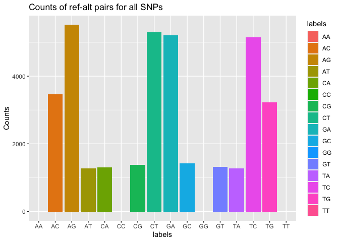
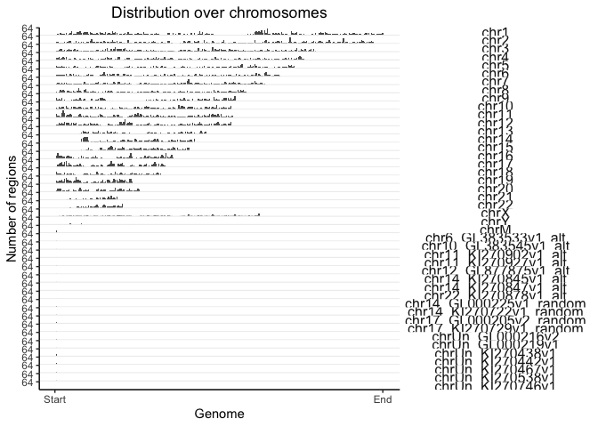

BMEG 424 Assignment 1
================

- [BMEG 424 Assignment 1:
  Introduction](#bmeg-424-assignment-1-introduction)
  - [Introduction:](#introduction)
    - [The Boring Stuff](#the-boring-stuff)
    - [The structure of the assignments in BMEG
      424/524](#the-structure-of-the-assignments-in-bmeg-424524)
    - [Installing R and R Studio](#installing-r-and-r-studio)
    - [Getting set up on the server](#getting-set-up-on-the-server)
    - [Submission:](#submission)
  - [Experiment and Analysis:](#experiment-and-analysis)
    - [Part 1: Working on the command
      line](#part-1-working-on-the-command-line)
      - [a. Basic commands](#a-basic-commands)
      - [b. Creating and moving files](#b-creating-and-moving-files)
    - [Part 2: Conda](#part-2-conda)
      - [a. Installing Conda](#a-installing-conda)
      - [b. Creating your first conda
        environment](#b-creating-your-first-conda-environment)
      - [c. Installing software with
        conda](#c-installing-software-with-conda)
    - [Part 3: Pipelines](#part-3-pipelines)
      - [a. Setting up a pipeline](#a-setting-up-a-pipeline)
    - [Part 4: Quality Control](#part-4-quality-control)
      - [a. Quality Control of raw sequencing
        data](#a-quality-control-of-raw-sequencing-data)
      - [b. Quality control of the
        alignment](#b-quality-control-of-the-alignment)
    - [Part 5: Vizualization and Downstream
      Analysis](#part-5-vizualization-and-downstream-analysis)
      - [a. Setting up a reproducible analysis in
        R](#a-setting-up-a-reproducible-analysis-in-r)
      - [b. Basics of R Analysis](#b-basics-of-r-analysis)
      - [c. Interactively viewing our variants in
        IGV](#c-interactively-viewing-our-variants-in-igv)
  - [Discussion (6 pts)](#discussion-6-pts)
- [Contributions](#contributions)

``` r
knitr::opts_chunk$set(echo = TRUE)
```

# BMEG 424 Assignment 1: Introduction

## Introduction:

### The Boring Stuff

Welcome to BMEG 424! We would like to begin by outlining some of the key
rules and regulations you will have to follow for the assignments in
this course:

- All assignments are to be completed individually or with one partner
- If you choose to work in pairs for an assignment, ONE of you should
  make a submission on canvas. In the submission you MUST report the
  name & student number of BOTH partners.
- Each time you work with a new partner you will need to create a new
  GitHub repo for that assignment. If you choose to work with the same
  partner for multiple assignments (or by yourself) you should include
  all assignments completed by the same TEAM in a single repo.
- Late assignments will have 10% deducted for each day they are late (0
  is recorded after 3 days late). Making changes to the files on your
  repo after the assignment has been submitted on Canvas will result in
  a late penalty unless an instructor has specifically asked you to
  change something.
- Each student will have to ensure their assignment files are knit
  correctly (see below for instructions) and legible on GitHub. Up to
  20% of the assignment marks can be removed at the TA’s discretion for
  incorrect knitting or formatting of assignment files.
- We are aware that some of you will choose to use large language models
  like ChatGPT to complete some portions of the assignment. You are free
  to use ChatGPT or other LLMs to help you on the assignment, *provided
  you cite the model, include your prompt, and indicate what portion was
  generated by AI* for each question where you received help.
- More generally, it is a requirement that you include any and all
  sources from where you received help (excluding your previously
  mentioned partner) or information for completing any question on the
  assignments. If you are unsure of when/how to cite your sources
  (including LLMs), please get in contact with the instructors.

If any of these rules are unclear please get in contact with the
instructors.

### The structure of the assignments in BMEG 424/524

Assignments will be split up into 3 sections: Introduction, Experiment
and Analysis, and Discussion. The introduction section is for the
instructors to give you information and context for the assignment you
are about to complete, there will never be any points assigned to this
section but it is still essential that you read it carefully. The
‘Experiment’ and Analysis section is where you will be doing the bulk of
your computational work. Much like your laboratory classes there will be
a protocol for you to follow for the generation, processing and
preparation of genomics data. Most of your marks in this section will
come from sharing the code you used to complete the assigned tasks
and/or the results you generated from data, but there may also be some
thinking questions you need to answer. The final discussion section will
contain questions about the theoretical underpinning of the topics
covered in the assignment.

Everything in the assignments that are worth marks will be in the
following format:

``` bash
#?# 0. This is what a question looks like. (0 pts)
You'd put your answer here
```

If you are not sure that your assignment is done simply search for \#?#
and make sure you’ve filled everything out.

### Installing R and R Studio

We will largely do our analysis in R. R is most easily set up by
downloading and installing RStudio
(<https://rstudio-education.github.io/hopr/starting.html>). Ensure you
have set up CRAN and Bioconductor
(<https://www.bioconductor.org/install/>) properly. If you have any
questions about setting up RStudio or Bioconductor please contact one of
the instructors. Messing up your R install can be a major headache.

### Getting set up on the server

For our course we will be using a server based on a Docker/Linux system.
This will be the place where you will do your assignments and project.
There are several things that you need to be aware while working on the
server:

**The server has limited storage and computer power.** Therefore, you
will be required to be mindful of the processes you run as well as the
files you keep. In general, files that are uncompressed (e.g. fastq,
sam) should either be compressed or deleted (more on that later) to
ensure we don’t run out of space. If we do run out of space, no one will
be able to write new data to disk, which will halt all progress until
space clears up.

**If we find that we are running out of space on the server we may
remove some marks from any students found to be hoarding data/space. If
you are having trouble managing your files please contact one of the
teaching staff.**

- **Windows system:**

  1.  Install a terminal emulator like Putty
      (*<https://www.chiark.greenend.org.uk/~sgtatham/putty/latest.html>*).

  2.  This will allow you to do a SSH connection using the server’s IP
      (orca1.bcgsc.ca) and your credentials. You can read the terminal
      emulators instructions for how to set up an SSH connection on your
      system & emulator.

- **Linux/Unix system (Apple computer and Ubuntu):**

  1.  Open a terminal

  2.  Type the following command: ssh <lli_bmeg24@orca1.bcgsc.ca>
      password: (bU2x4YiK@

  3.  When prompted, type your password to complete the login

Now that you have successfully joined the server, let’s get you used to
some basic commands.

### Submission:

Submit your assignment as a knitted RMarkdown document. You will push
your knitted RMarkdown document to your github repository (one for each
group). You will then submit the link, along with the names and student
numbers of all students who worked on the assignment to the assignment 2
page on Canvas. Your assignment should be submtited, and your last
commit should be made, before 11:59pm on the day of the deadline. Late
assignments will will be deducted 10% per day late. Assignments will not
be accepted after 3 days past the deadline.

## Experiment and Analysis:

### Part 1: Working on the command line

#### a. Basic commands

If you are already familiar with working on linux/unix based systems,
then you may want to skip this section. There are no marks assigned
until “Creating and moving Files”.

The command line is a powerful tool which allows you to interact a
computer without a graphical user interface (GUI). The majority of
bioinformatics tools/software are run through the command line rather
than a GUI. Before you are able to use these software you will have to
know how perform basic tasks on a computer without a GUI, such as moving
around the file system, creating files and directories, and
editing/moving files.

The first thing you will need to know how to do is to move around the
file system. In linux systems files are organized in directories (often
called folders in Windows systems). The directories are organized in a
tree, with the root directory being the top directory (denoted by “/”).
As a user, you are always located in a single directory which is called
your “working directory”.

You can see what directory you are in by typing `pwd` into the command
line.

``` bash
#?# 1. Paste the output of pwd here (0 pts)
# Note: This question, along with all the others in Part 1, will not be graded. This section is here purely to get you up to speed. 
```

Each of you has a home directory on the server. You can see the path to
your home directory by typing `echo $HOME` or `echo ~` into the command
line.

If you want to see the contents of your current directory you can type
`ls` into the command line. Some files/directories will be hidden by
default but can be seen by typing `ls -a`.

``` bash
#?# 2. Paste the output of ls -a here (0 pts)
```

You can create a directory by typing `mkdir <directory name>` into the
command line. You can move into a directory by typing
`cd <directory name>` into the command line. You can move up a directory
by typing `cd ..` into the command line.

``` bash
#?# 3. Create a directory called "A1" and move into it. Paste the output of pwd here (0 pts)
```

``` bash
#?# 4. Type a command which will list the contents of the parent directory of your current working directory (0 pts)
```

#### b. Creating and moving files

You can create a file by typing `touch <file name>` into the command
line. Usually we denote file type by including a period followed by an
extension at the end of the file name. For example, genomic sequencing
data is often stored in the fastq file format, and therefore these
sequence files are usually marked with *filename.fastq*. However, unlike
on Windows systems the file extension doesn’t actually do anything on
linux systems, a fastq file named *filename.txt* is still a fastq file.

You can copy a file to a new location by typing
`cp <file name> <destination>` into the command line. You will have to
include either a relative (path from current directory) or absolute
(path starting from root directory) in front of the file name and
destination if they are not in the working directory. You can delete a
file by typing `rm <file name>` into the command line.

If you want to copy a file to a new location AND delete the original
file in a single command you can type `mv <file name> <destination>`
into the command line.

### Part 2: Conda

#### a. Installing Conda

Conda is a package and environment manager
(<https://docs.conda.io/en/latest/>). Conda is an excellent tool for
managing computing environments.

In your home directory use wget to download the following file:
<https://repo.anaconda.com/archive/Anaconda3-2022.10-Linux-x86_64.sh>
Run the Anaconda3-2021.11-Linux-x86_64.sh bash script you just
downloaded. Say yes to any prompts you get. Finish you installation by
logging out and back into the server.

``` bash
#?# 5. Once you've logged back into the server, paste the output of conda --version here (0.25 pts)
# conda 22.9.0
```

#### b. Creating your first conda environment

Conda environments are a great way to manage the software you use for
different projects. You can create a new conda environment by typing
`conda create -n <environment name> <list of packages>` into the command
line. Usually you’ll want to include python in your environment.

You’ll want to keep a seperate environment for each of your assignments
so that software you install for one assignment doesn’t interfere with
software you install for another assignment.

``` bash
#?# 6. Create a directory to store your environments in your home directory. Initialize a conda environment *inside* that directory called A1. Paste the commands you used below (1 pts)

mkdir /home/lli_bmeg24/conda_envs
conda create -p /home/lli_bmeg24/conda_envs/A1
```

Usually conda installs things in the ~/.conda directory. You are
installing them in a different directory so that it’s easy for the TA to
find it if something goes wrong.

Now you’ll want to activate your new environment. You can do so by
typing `conda activate --prefix <path to environment>` into the command
line.

#### c. Installing software with conda

Todays task involves aligning some sequencing data to a reference genome
and then performing variant calling on the aligned data. Variant calling
is a process where we identify difference between the reference genome
and the genome of the sample we sequenced. This is commonly done to
identify mutations in patient genomes after whole genome sequencing or
whole exome sequencing.

We will be using a tool called bowtie2 to align our data and a tool
called bcftools to perform variant calling. We’ll also need a few other
tools to complete our analysis, the list is:

- fastQC (<https://www.bioinformatics.babraham.ac.uk/projects/fastqc/>):
  comprehensive quality control measures of sequencing data.
- bowtie2 (<http://bowtie-bio.sourceforge.net/bowtie2/index.shtml>):
  alignments of sequencing data.
- htop & screen: bash system tools to visualize the server capacity and
  to run commands in the background, respectively
- samtools (<http://www.htslib.org/>): manipulation of sequencing data.
  - mpileup: a part of samtools which is used for variant calling from
    sequencing data. Will be installed with samtools.
  - bcftools (<http://www.htslib.org/>): a part of samtools which is
    used for variant calling from sequencing data. Will be installed
    with samtools.

In order to install the tools we need for this course you will have to
add two channels on top of the defaults channel that comes loaded with
conda. You can do this by typing
`conda config --add channels <channel name>` into the command line. The
two channels you will need to add are bioconda and conda-forge.

``` bash
#?# 7. AFTER adding the appropriate channels type the command which will list all the channels you have added to conda (0.25 pts) and paste the output below. (0.25 pts)

conda config --get channels

#--add channels 'defaults'   # lowest priority
#--add channels 'bioconda'
#--add channels 'conda-forge'   # highest priority
```

You can install all of the necessary tools by typing
`conda install <list of packages>` into the command line. It’s generally
easier to install all the packages at once rather than one at a time and
allow conda to resolve any conflicts.

``` bash
#?# 8. Install all the tools listed above into your A1 environment using a single command. Paste the command you used below. (1 pts)

conda install fastQC bowtie2 conda-forge::screen conda-forge::htop bioconda::samtools
```

### Part 3: Pipelines

Pipelines are a useful way to organize and automate your analysis of
data. They allow you to set up a series of steps in a predefined and
predictable order. This may seem like a waste of time on these
assignments where you are only analyzing a single or a handful of
samples, but it will be essential when you are analyzing hundreds or
thousands of samples.

#### a. Setting up a pipeline

For this course we will be using a pipeline manager called Snakemake
(<https://snakemake.readthedocs.io/en/stable/>). Snakemake is a python
based pipeline manager which will easily interface with conda and your
various software tools installed thereby. Snakemake also handles many of
the common issues in pipeline management like parallelization,
dependency management, error handling, and run
configuration/customization.

First we’ll need to add snakemake to our conda environment. You can do
this by typing `conda install -c bioconda snakemake` into the command
line.

First create a directory within your A1 directory called “pipeline”.
Then create a file called “Snakefile” within the pipeline directory.

Snakemake uses a python based syntax to define the steps in your
pipeline, these steps are called “rules”. Each rule has a set of inputs,
and a set of outputs. Rule are dependent on one another based on their
inputs and outputs. For example, if rule A has an output which is the
input for rule B, then rule B will not run until rule A has completed.
Rules which are not dependent on one another will run in parallel.

Create your Snakefile in the pipeline directory. Here is an example of
the rule for running fastqc on your input data (which should now be in
~/A1/). You can do a little magic to tell snakemake where the conda
environment is. You can do this by adding the following line to the top
of your Snakefile:

``` python
#conda_env: "/home/<username>/condaEnvs/A1"

conda_env: "/home/lli_bmeg24/conda_envs/A1"
```

Then when you run snakemake you’ll have to include the flag
`--use-conda` to tell snakemake to use the conda environment you
specified. This works because you only need one conda environment for
the whole pipeline, and snakemake will automatically activate the
environment for each rule.

Here is some of the Snakefile (the rule for running fastqc and the rule
for aligning the data) for you to begin with:

``` python
# Snakefile
rule fastqc:
    input:
        "/path/to/data/{sample}_1.fastq.gz",
        "/path/to/data/{sample}_2.fastq.gz"
    output:
        "fastqc/{sample}_1_fastqc.html",
        "fastqc/{sample}_2_fastqc.html"
    shell:
        "fastqc {input} --outdir fastqc"

rule align:
    input:
        fastq1 = "/path/to/data/{sample}_1.fastq.gz",
        fastq2 = "/path/to/data/{sample}_2.fastq.gz",
    output:
        sam = "aligned/{sample}.sam"
    shell:
        "bowtie2 -x /projects/bmeg/indexes/hg38/hg38_bowtie2_index -1 {input.fastq1} -2 {input.fastq2} -S {output.sam}"
```

Before you start running your snakefile you will need to make sure it is
set up correctly. You can type `snakemake -np` into the command line to
check that your snakefile is set up correctly. Note this will only work
if your snakefile is called “Snakefile” and is in your current working
directory.

Our pipeline will consist of the following steps: - Quality control of
the raw sequencing data (fastqc) - Alignment of the sequencing data to
the reference genome (bowtie2, paired-end using both forward and reverse
reads and the hg38 genome) - Sorting the aligned data (samtools) -
Variant calling (bcftools; installed with samtools)

It is up to you to implement the remainining steps

``` python
#?# 9. Fill in the rest of the Snakefile to include rules for sorting the aligned data, indexing the sorted data, and calling variants. (5 pts)
# Note: Include the ENTIRE Snakefile in your submission. Not just the rules you added.

conda_env: "/home/lli_bmeg24/conda_envs/A1"

# Snakefile
rule all: 
    input:
        expand("/home/lli_bmeg24/A1/pipeline/variant_calling/{sample}.vcf", sample = ["subset_SRR099957"]),
        expand("/home/lli_bmeg24/A1/pipeline/fastqc/{sample}_1_fastqc.html", sample = ["subset_SRR099957"]),
        expand("/home/lli_bmeg24/A1/pipeline/fastqc/{sample}_2_fastqc.html", sample = ["subset_SRR099957"])


rule fastqc:
    input:
        "/projects/bmeg/A1/{sample}_1.fastq.gz",
        "/projects/bmeg/A1/{sample}_2.fastq.gz"
    output:
        "/home/lli_bmeg24/A1/pipeline/fastqc/{sample}_1_fastqc.html",
        "/home/lli_bmeg24/A1/pipeline/fastqc/{sample}_2_fastqc.html"
    shell:
        "fastqc {input} --outdir /home/lli_bmeg24/A1/pipeline/fastqc/"

rule align:
    input:
        fastq1 = "/projects/bmeg/A1/{sample}_1.fastq.gz",
        fastq2 = "/projects/bmeg/A1/{sample}_2.fastq.gz",
    output:
        sam = "/home/lli_bmeg24/A1/pipeline/aligned/{sample}.sam"
    shell:
        "bowtie2 -x /projects/bmeg/indexes/hg38/hg38_bowtie2_index -1 {input.fastq1} -2 {input.fastq2} -S {output.sam}"

rule sort: 
    input: 
        sam = "/home/lli_bmeg24/A1/pipeline/aligned/{sample}.sam"
    output:
        sorted_bam = "/home/lli_bmeg24/A1/pipeline/sorted/{sample}_sorted.bam"
    shell:
        "samtools sort {input.sam} -o {output.sorted_bam}"


rule variant_calling: 
    input: 
        sorted_bam = "/home/lli_bmeg24/A1/pipeline/sorted/{sample}_sorted.bam"
    output:
        variant_calling = "/home/lli_bmeg24/A1/pipeline/variant_calling/{sample}.vcf"
    shell:
        "bcftools mpileup -Ou -f /projects/bmeg/indexes/hg38/hg38.fa {input.sorted_bam} | bcftools call -mv -Ob -o {output.variant_calling}"
```

Citation: Variant calling. (n.d.). Samtools.github.io.
<https://samtools.github.io/bcftools/howtos/variant-calling.html>

You should also check to see that the dependency map of your snakefile
is correct. Once you have confirmed that your snakefile is set up
correctly you can type `snakemake --dag | dot -Tsvg > dag.svg` into the
command line to generate a dependency map of your snakefile. You can
view the dependency map by typing `eog dag.svg` into the command line.

``` bash
#?# 10. Include the dependency map of your Snakefile below using Rmarkdown syntax (1 pts)
# The correct Rmarkdown syntax is  
```

<figure>

<figcaption aria-hidden="true">dag</figcaption>
</figure>

``` bash
#?# 11. Explain what the dependency map is showing and whether or not you think it is correct. (1 pts)

# The dependency map shows the steps necessary to obtain the results we outlined in the rull all. The vcf files can be generated from the rule align --> sort --> variant_calling. The html files can be generated directly from the rule fastqc.  
```

Run your pipeline on the sequence data provided. You can do this by
typing `snakemake --use-conda --cores=1 --resources mem_mb=4000` into
the command line. You can use screen and htop to check the server usage
and determine the correct number of resources to allocate (NOTE: If you
don’t pass any resources to snakemake it will use all available
resources on the server, which is very inconsiderate to your
classmates). **Please do not exceed 4GB of memory per job or a single
core**, use less if you think it’s necessary.

``` bash
#?# 12. Paste the output of snakemake here (0.25 pts)

Building DAG of jobs...
Using shell: /bin/bash
Provided cores: 1 (use --cores to define parallelism)
Rules claiming more threads will be scaled down.
Provided resources: mem_mb=4000
Job stats:
job                count
---------------  -------
align                  1
all                    1
fastqc                 1
sort                   1
variant_calling        1
total                  5

Select jobs to execute...

[Fri Jan 19 01:01:56 2024]
rule align:
    input: /projects/bmeg/A1/subset_SRR099957_1.fastq.gz, /projects/bmeg/A1/subset_SRR099957_2.fastq.gz
    output: /home/lli_bmeg24/A1/pipeline/aligned/subset_SRR099957.sam
    jobid: 3
    reason: Missing output files: /home/lli_bmeg24/A1/pipeline/aligned/subset_SRR099957.sam
    wildcards: sample=subset_SRR099957
    resources: tmpdir=/tmp

500000 reads; of these:
  500000 (100.00%) were paired; of these:
    50779 (10.16%) aligned concordantly 0 times
    333976 (66.80%) aligned concordantly exactly 1 time
    115245 (23.05%) aligned concordantly >1 times
    ----
    50779 pairs aligned concordantly 0 times; of these:
      5612 (11.05%) aligned discordantly 1 time
    ----
    45167 pairs aligned 0 times concordantly or discordantly; of these:
      90334 mates make up the pairs; of these:
        75415 (83.48%) aligned 0 times
        8614 (9.54%) aligned exactly 1 time
        6305 (6.98%) aligned >1 times
92.46% overall alignment rate
[Fri Jan 19 01:05:03 2024]
Finished job 3.
1 of 5 steps (20%) done
Select jobs to execute...

[Fri Jan 19 01:05:03 2024]
rule fastqc:
    input: /projects/bmeg/A1/subset_SRR099957_1.fastq.gz, /projects/bmeg/A1/subset_SRR099957_2.fastq.gz
    output: /home/lli_bmeg24/A1/pipeline/fastqc/subset_SRR099957_1_fastqc.html, /home/lli_bmeg24/A1/pipeline/fastqc/subset_SRR099957_2_fastqc.html
    jobid: 4
    reason: Missing output files: /home/lli_bmeg24/A1/pipeline/fastqc/subset_SRR099957_2_fastqc.html, /home/lli_bmeg24/A1/pipeline/fastqc/subset_SRR099957_1_fastqc.html
    wildcards: sample=subset_SRR099957
    resources: tmpdir=/tmp

application/gzip
application/gzip
Started analysis of subset_SRR099957_1.fastq.gz
Approx 5% complete for subset_SRR099957_1.fastq.gz
Approx 10% complete for subset_SRR099957_1.fastq.gz
Approx 15% complete for subset_SRR099957_1.fastq.gz
Approx 20% complete for subset_SRR099957_1.fastq.gz
Approx 25% complete for subset_SRR099957_1.fastq.gz
Approx 30% complete for subset_SRR099957_1.fastq.gz
Approx 35% complete for subset_SRR099957_1.fastq.gz
Approx 40% complete for subset_SRR099957_1.fastq.gz
Approx 45% complete for subset_SRR099957_1.fastq.gz
Approx 50% complete for subset_SRR099957_1.fastq.gz
Approx 55% complete for subset_SRR099957_1.fastq.gz
Approx 60% complete for subset_SRR099957_1.fastq.gz
Approx 65% complete for subset_SRR099957_1.fastq.gz
Approx 70% complete for subset_SRR099957_1.fastq.gz
Approx 75% complete for subset_SRR099957_1.fastq.gz
Approx 80% complete for subset_SRR099957_1.fastq.gz
Approx 85% complete for subset_SRR099957_1.fastq.gz
Approx 90% complete for subset_SRR099957_1.fastq.gz
Approx 95% complete for subset_SRR099957_1.fastq.gz
Approx 100% complete for subset_SRR099957_1.fastq.gz
Analysis complete for subset_SRR099957_1.fastq.gz
Started analysis of subset_SRR099957_2.fastq.gz
Approx 5% complete for subset_SRR099957_2.fastq.gz
Approx 10% complete for subset_SRR099957_2.fastq.gz
Approx 15% complete for subset_SRR099957_2.fastq.gz
Approx 20% complete for subset_SRR099957_2.fastq.gz
Approx 25% complete for subset_SRR099957_2.fastq.gz
Approx 30% complete for subset_SRR099957_2.fastq.gz
Approx 35% complete for subset_SRR099957_2.fastq.gz
Approx 40% complete for subset_SRR099957_2.fastq.gz
Approx 45% complete for subset_SRR099957_2.fastq.gz
Approx 50% complete for subset_SRR099957_2.fastq.gz
Approx 55% complete for subset_SRR099957_2.fastq.gz
Approx 60% complete for subset_SRR099957_2.fastq.gz
Approx 65% complete for subset_SRR099957_2.fastq.gz
Approx 70% complete for subset_SRR099957_2.fastq.gz
Approx 75% complete for subset_SRR099957_2.fastq.gz
Approx 80% complete for subset_SRR099957_2.fastq.gz
Approx 85% complete for subset_SRR099957_2.fastq.gz
Approx 90% complete for subset_SRR099957_2.fastq.gz
Approx 95% complete for subset_SRR099957_2.fastq.gz
Approx 100% complete for subset_SRR099957_2.fastq.gz
Analysis complete for subset_SRR099957_2.fastq.gz
[Fri Jan 19 01:05:21 2024]
Finished job 4.
2 of 5 steps (40%) done
Select jobs to execute...

[Fri Jan 19 01:05:21 2024]
rule sort:
    input: /home/lli_bmeg24/A1/pipeline/aligned/subset_SRR099957.sam
    output: /home/lli_bmeg24/A1/pipeline/sorted/subset_SRR099957_sorted.bam
    jobid: 2
    reason: Missing output files: /home/lli_bmeg24/A1/pipeline/sorted/subset_SRR099957_sorted.bam; Input files updated by another job: /home/lli_bmeg24/A1/pipeline/aligned/subset_SRR099957.sam
    wildcards: sample=subset_SRR099957
    resources: tmpdir=/tmp

[Fri Jan 19 01:05:28 2024]
Finished job 2.
3 of 5 steps (60%) done
Select jobs to execute...

[Fri Jan 19 01:05:28 2024]
rule variant_calling:
    input: /home/lli_bmeg24/A1/pipeline/sorted/subset_SRR099957_sorted.bam
    output: /home/lli_bmeg24/A1/pipeline/variant_calling/subset_SRR099957.vcf
    jobid: 1
    reason: Missing output files: /home/lli_bmeg24/A1/pipeline/variant_calling/subset_SRR099957.vcf; Input files updated by another job: /home/lli_bmeg24/A1/pipeline/sorted/subset_SRR099957_sorted.bam
    wildcards: sample=subset_SRR099957
    resources: tmpdir=/tmp

Note: none of --samples-file, --ploidy or --ploidy-file given, assuming all sites are diploid
[mpileup] 1 samples in 1 input files
[mpileup] maximum number of reads per input file set to -d 250
[Fri Jan 19 01:07:18 2024]
Finished job 1.
4 of 5 steps (80%) done
Select jobs to execute...

[Fri Jan 19 01:07:18 2024]
localrule all:
    input: /home/lli_bmeg24/A1/pipeline/variant_calling/subset_SRR099957.vcf, /home/lli_bmeg24/A1/pipeline/fastqc/subset_SRR099957_1_fastqc.html, /home/lli_bmeg24/A1/pipeline/fastqc/subset_SRR099957_2_fastqc.html
    jobid: 0
    reason: Input files updated by another job: /home/lli_bmeg24/A1/pipeline/variant_calling/subset_SRR099957.vcf, /home/lli_bmeg24/A1/pipeline/fastqc/subset_SRR099957_2_fastqc.html, /home/lli_bmeg24/A1/pipeline/fastqc/subset_SRR099957_1_fastqc.html
    resources: tmpdir=/tmp

[Fri Jan 19 01:07:18 2024]
Finished job 0.
5 of 5 steps (100%) done
Complete log: .snakemake/log/2024-01-19T010154.272212.snakemake.log
```

### Part 4: Quality Control

#### a. Quality Control of raw sequencing data

Download the fastqc reports from the fastqc directory and include each
of the graphs in your Rmarkdown file the same way you included the
dependency map.

    #?# 13. Include the fastqc graphs from the QC on the forward read (read 1) file in your Rmarkdown file below this block. For each graph include a brief description of what the graph is showing and whether or not you think the data passed the quality control. (5 pts) 
    # Please try to seperate your descriptions by including an text block between for description. 

<figure>

<figcaption aria-hidden="true">adapter_content</figcaption>
</figure>

    What this graph shows is the % of adapter in the sequences. >10% is a fail, 5%-10% is warning and less than 5% is a pass. 

    This plot shows that all kinds of adapters are around 0%. 

    PASS

<figure>

<figcaption aria-hidden="true">duplication_levels</figcaption>
</figure>

    What this graph shows is the percentage of sequences for each duplication level (number of times the sequence is duplicated).

    The percentage of sequences remaining if deduplicated is 98.84% which is quite high, meaning that there is not much duplication happened at the PCR stage. This is also shwon by the plot because around 98% of the sequences are at duplication level 1 so 98% of them are not duplicated. 

    PASS

<figure>

<figcaption aria-hidden="true">per_base_n_content</figcaption>
</figure>

    What this graph shows is the percentage of N across all bases. When a sequencer is unable to distinguish between the bases (TGAC), it will give a N to the position. 

    This plot shows that the % of N stays uniform arount  0%, meaning that there are not N content in the readings. 

    PASS

<figure>

<figcaption aria-hidden="true">per_base_quality</figcaption>
</figure>

    What this graph shows is the quality score per base, the green yellow and red regions are high medium and low quality regions. The yellow boxes are boxplot of the quality scores for that specific base. The red line is the median and the blue line is the mean. 

    This per base quality graph demonstrates a common distirbution of quality score for illumina sequencing. The general trend is expected and the quality score is expected to drop as we move down. 

    PASS

<figure>

<figcaption aria-hidden="true">per_base_sequence_content</figcaption>
</figure>

    What this graph shows is the percentage of base: TCGA, of position in reads. 

    This graph shows that this is all DNA data and the distribution of the four bases are quite uniform, all within 20-30.

    PASS

<figure>

<figcaption aria-hidden="true">per_sequence_gc_content</figcaption>
</figure>

    What this graph shows is the distribution of base G and C over all sequences. 

    This graph is a good representation because the peak is around 45% which is the %GC in basic statistics. The distribution also follows a normal distribution which is an ideal situation. 

    PASS

<figure>

<figcaption aria-hidden="true">per_sequence_quality</figcaption>
</figure>

    What this graph shows is the number of sequences (y-axis) for each unique quality score (x-axis). 

    This graph shows that majority of the reads have a relatively high quality score, although there is an obvious bump at the lower qwuality end. It is worth it to check on the reads that have low quality score around the bump area or quality score around 2. 

    Warning or PASS upon checking

<figure>

<figcaption aria-hidden="true">per_tile_quality</figcaption>
</figure>

    What this graph shows is the average quality score for each tile for all positions.

    This graph has an uniform colour meaning that there is discrepency between each tile. 

    PASS

<figure>

<figcaption aria-hidden="true">sequence_length_distribution</figcaption>
</figure>

    What this graph shows is the distribution of sequence length over all sequences. 

    This plot shows that 500000 sequences have sequence length == 76.

    PASS

Citation: Khetani, M. P., Radhika. (2018, September 5). Quality control:
Assessing FASTQC results. Introduction to RNA-Seq Using High-Performance
Computing - ARCHIVED.
<https://hbctraining.github.io/Intro-to-rnaseq-hpc-salmon/lessons/qc_fastqc_assessment.html>

…

#### b. Quality control of the alignment

For this section we will be using samtools to check the alignment of our
data.

    #?# 14. Use samtools flagstat to check the alignment rate of the sample you ran. Paste the output below (0.5 pts) and explain what the output means (1.5 pts)

    1000000 + 0 in total (QC-passed reads + QC-failed reads)
    1000000 + 0 primary
    0 + 0 secondary
    0 + 0 supplementary
    0 + 0 duplicates
    0 + 0 primary duplicates
    924585 + 0 mapped (92.46% : N/A)
    924585 + 0 primary mapped (92.46% : N/A)
    1000000 + 0 paired in sequencing
    500000 + 0 read1
    500000 + 0 read2
    898442 + 0 properly paired (89.84% : N/A)
    914236 + 0 with itself and mate mapped
    10349 + 0 singletons (1.03% : N/A)
    3180 + 0 with mate mapped to a different chr
    1857 + 0 with mate mapped to a different chr (mapQ>=5)

Citation: ChatGPT3.5 –\> “How to use samtools flagstat to check the alignment rate
of a sample”

    According to this output, we have 1,000,000 reads in total and no QC-failed reads. All 1,000,000 are all primary reads. Around 92.46% of reads are mapped. All 1,000,000 are paired in sequecning between the 1 and 2 read. There are 89.84% are properly paired, meaning both ends of the paired reads are mapped correctly. There are also 914236 reads that have their both ends mapped correctly to the reference, also for the paired reads. Around 1.03% of reads habe one end mapped. There are 3180 reads that have the paired read mapped to a different chromosome. The mapQ>=5 indicated a stricter requirement and there are 1857 reads has their paired reads mapped to a different chromosome. 

Citation: ChatGPT3.5 –\> “Can you explain in detail what the results indicate”

### Part 5: Vizualization and Downstream Analysis

#### a. Setting up a reproducible analysis in R

Before you start analyzing the sequencing data, we will go over some
essential methods for reprodicible analysis in R. Generally installing
packages in RStudio is very easy, with packages being mantained on the
CRAN repository. For example to install the common ggplot visualization
package in RStudio:

``` r
install.packages("ggplot2")
```

or to install from Bioconductor, you can use the BiocManager package:

``` r
if (!requireNamespace("BiocManager", quietly = TRUE)) {
    install.packages("BiocManager")
}
BiocManager::install("<package-name>")
```

However RStudio does not generally save which versions of packages you
had installed at the time of a particular analysis, so if you were
trying to reproduce your analysis at a later date you might run into
serious headaches either updating the code or trying to install
(potentially hundreds of) outdated packages and dependencies. In order
to solve this issue you can use package managers which work similarly to
how conda managed our command line software. In this course we will be
using the renv package.

``` r
install.packages("renv")
```

An R library is a directory on your computer where R stores all the
packages you have installed. You can see where your system library is by
typing `.libPaths()` into your R interpreter. Normally when you type
`install.packages()` into your R interpreter you install (from a
repository like CRAN or Bioconductor) into what’s caled the
system/global library. This is the equivalent of installing software
directly onto your computer instead of within a conda environment in
that the global library will be shared across all projects. This is a
remarkably bad practice with regards to reproduciblity and project-based
analysis.

Once you have renv installed you can create a new library by typing
`renv::init()` into your R interpreter. This will create a new library
in your current working directory. You can then install packages into
this library by typing `renv::install()` into your R interpreter. You
can also install packages from a specific repository by typing
`renv::install("package_name", repos = "https://cran.rstudio.com")` into
your R interpreter. Because renv doesn’t interfere with existing package
management workflows you can still use `install.packages()` and
`BiocManager::install()` to install packages into your project library
so long as you’ve initialized renv in your project.

#### b. Basics of R Analysis

For this section you will want to install tidyverse
(<https://www.tidyverse.org/>), a collection of packages for data
manipulation and visualization. We will need it for the ggplot2 package
which it includes.

\#?# 15. Below is an R function for reading a VCF file and counting the
number of occurrences of each unique ref-alt pair in all of the SNPs
present in the VCF file. There are a few bugs in the code. Debug the
function (2 pts) and add comments to explain what each line of code is
doing (1 pts).

``` r
library(data.table)
count_SNPs <- function(file_path) {

    vcf_data <- fread(file_path, sep='\t', header = TRUE, skip = '#CHROM') # this is reading into the .vcf file skipping the headers of the file to #CHROM

    ref_alt_data = data.frame(vcf_data$REF, vcf_data$ALT) # extracting the REF and ALT column from the .vcf data
    colnames(ref_alt_data) = c("REF", "ALT") # renaming the columns so that they can be referred later
    ref_alt_data <- ref_alt_data[apply(ref_alt_data, 1, function(x) all(nchar(x) == 1)), ] # this is to filter our the rows that has entries that are not of length 1 character

    counts <- table(ref_alt_data$REF, ref_alt_data$ALT) # the table function outputs the number of each combination of unique values from the two columns

    result_df <- data.frame(
        ALT = rep(rownames(counts), each = ncol(counts)),
        REF = rep(colnames(counts), times = nrow(counts)),
        COUNT = as.vector(counts)
    ) # here we are creating a data frame that canbe outputed that concluded the information from counts

    return(result_df) # returning the output
}
```

Citation: How to read vcf file in R. (n.d.). Stack Overflow. Retrieved
January 20, 2024, from
<https://stackoverflow.com/questions/32513776/how-to-read-vcf-file-in-r>

\#?# 16. Use the returned data frame to plot the ref-alt pairs for all
SNPs as a bar plot (1 pts)

    # Include the code you used to generate the plot in this block. When you knit your document the plot will be generated and displayed below.

``` r
library(ggplot2)
output = count_SNPs("/Users/leonli/Desktop/BMEG 424/BMEG424_LL/A1/A1_files/subset_SRR099957.vcf")
df = data.frame(labels = paste(output$ALT, output$REF, sep = '' ), count = output$COUNT)
ggplot(df, aes(x = labels, y = count, fill = labels)) +
     geom_bar(stat = "identity") +
     ggtitle("Counts of ref-alt pairs for all SNPs") +
     ylab("Counts") 
```

<!-- --> Citation: ChatGPT3.5: –\>
“How to generate a bar plot in R, provide an example”

\#?# 17. Below is a plot which shows the distribution of variants across
the genome, with peaks being colored by the depth of reads at that
genomic locus. Recreate this plot using the data from your sample. (4
pts)

``` r
# HINT: You'll want to start by looking at the documentation for the GenomicRanges and GenomicDistributions packages.
library(GenomicRanges)
```

    ## Loading required package: stats4

    ## Loading required package: BiocGenerics

    ## 
    ## Attaching package: 'BiocGenerics'

    ## The following objects are masked from 'package:stats':
    ## 
    ##     IQR, mad, sd, var, xtabs

    ## The following objects are masked from 'package:base':
    ## 
    ##     anyDuplicated, aperm, append, as.data.frame, basename, cbind,
    ##     colnames, dirname, do.call, duplicated, eval, evalq, Filter, Find,
    ##     get, grep, grepl, intersect, is.unsorted, lapply, Map, mapply,
    ##     match, mget, order, paste, pmax, pmax.int, pmin, pmin.int,
    ##     Position, rank, rbind, Reduce, rownames, sapply, setdiff, sort,
    ##     table, tapply, union, unique, unsplit, which.max, which.min

    ## Loading required package: S4Vectors

    ## 
    ## Attaching package: 'S4Vectors'

    ## The following objects are masked from 'package:data.table':
    ## 
    ##     first, second

    ## The following object is masked from 'package:utils':
    ## 
    ##     findMatches

    ## The following objects are masked from 'package:base':
    ## 
    ##     expand.grid, I, unname

    ## Loading required package: IRanges

    ## 
    ## Attaching package: 'IRanges'

    ## The following object is masked from 'package:data.table':
    ## 
    ##     shift

    ## Loading required package: GenomeInfoDb

``` r
library(GenomicDistributions)
library(VariantAnnotation)
```

    ## Loading required package: MatrixGenerics

    ## Loading required package: matrixStats

    ## 
    ## Attaching package: 'MatrixGenerics'

    ## The following objects are masked from 'package:matrixStats':
    ## 
    ##     colAlls, colAnyNAs, colAnys, colAvgsPerRowSet, colCollapse,
    ##     colCounts, colCummaxs, colCummins, colCumprods, colCumsums,
    ##     colDiffs, colIQRDiffs, colIQRs, colLogSumExps, colMadDiffs,
    ##     colMads, colMaxs, colMeans2, colMedians, colMins, colOrderStats,
    ##     colProds, colQuantiles, colRanges, colRanks, colSdDiffs, colSds,
    ##     colSums2, colTabulates, colVarDiffs, colVars, colWeightedMads,
    ##     colWeightedMeans, colWeightedMedians, colWeightedSds,
    ##     colWeightedVars, rowAlls, rowAnyNAs, rowAnys, rowAvgsPerColSet,
    ##     rowCollapse, rowCounts, rowCummaxs, rowCummins, rowCumprods,
    ##     rowCumsums, rowDiffs, rowIQRDiffs, rowIQRs, rowLogSumExps,
    ##     rowMadDiffs, rowMads, rowMaxs, rowMeans2, rowMedians, rowMins,
    ##     rowOrderStats, rowProds, rowQuantiles, rowRanges, rowRanks,
    ##     rowSdDiffs, rowSds, rowSums2, rowTabulates, rowVarDiffs, rowVars,
    ##     rowWeightedMads, rowWeightedMeans, rowWeightedMedians,
    ##     rowWeightedSds, rowWeightedVars

    ## Loading required package: SummarizedExperiment

    ## Loading required package: Biobase

    ## Welcome to Bioconductor
    ## 
    ##     Vignettes contain introductory material; view with
    ##     'browseVignettes()'. To cite Bioconductor, see
    ##     'citation("Biobase")', and for packages 'citation("pkgname")'.

    ## 
    ## Attaching package: 'Biobase'

    ## The following object is masked from 'package:MatrixGenerics':
    ## 
    ##     rowMedians

    ## The following objects are masked from 'package:matrixStats':
    ## 
    ##     anyMissing, rowMedians

    ## Loading required package: Rsamtools

    ## Loading required package: Biostrings

    ## Loading required package: XVector

    ## 
    ## Attaching package: 'Biostrings'

    ## The following object is masked from 'package:base':
    ## 
    ##     strsplit

    ## 
    ## Attaching package: 'VariantAnnotation'

    ## The following object is masked from 'package:base':
    ## 
    ##     tabulate

``` r
library(GenomicDistributionsData)

vcf = readVcf("/Users/leonli/Desktop/BMEG 424/BMEG424_LL/A1/A1_files/subset_SRR099957.vcf", "hg38")
a = calcChromBinsRef(vcf@rowRanges, "hg38")
```

    ## see ?GenomicDistributionsData and browseVignettes('GenomicDistributionsData') for documentation

    ## loading from cache

``` r
plotChromBins(a)
```

<!-- -->

Citation: ChatGPT3.5: –\> “How to create a GRanges object if we start with a .vcf
file”

#### c. Interactively viewing our variants in IGV

You can download the IGV viewer from here:
<https://software.broadinstitute.org/software/igv/home>. IGV is an
interactive tool to visualize different data types of genetic
information (e.g. bam, bed files). You will install this tool to your
**local computer**. To visualize where the reads of our ChIP analysis
mapped in the genome.

Once you boot up IGV select your reference genome and load your VCF
file. Zoom into this position: `chr1: 1,000,000-1,100,000`.

    #?# 17. Post a screenshot of your IGV window below (1pts)

<figure>

<figcaption aria-hidden="true">IGV</figcaption>
</figure>

## Discussion (6 pts)

\#?# 18. Do you think the subset of sequence data you analyzed was from
Whole Genome Sequencing or Whole Exome Sequencing? Justify your response
with evidence. (4 pts)

    The subset of sequency daya was from a whole genome sequencing. As shown in the image below when we zoom into one of the variant. When comparing to the reference data, we can see that the variant appears inside an intron or non-sequencing region. 

<figure>

<figcaption aria-hidden="true">IGV_zoomin</figcaption>
</figure>

Assuming your snakemake run was supposed to process 1000 samples instead
of 1 sample.

``` bash
#?# 19. How would you go about checking the quality of all the samples? (1 pts)

The rule fastqc can be used to check the quality of the samples. The different plots within the html are labelled with error, warning or correct. There can be a quality check based on these tests to flag low-quality samples.  
```

``` bash
#?# 20. If the run crashed on sample 500, how would you go about restarting the run? (1 pts)
The first step is to check the snakemake log file to deduce what went wrong and determine if the sample 500 crashed before generating any intermediate steps. If there are any files that are incomplete, we need to delete all intermediate outputs. And then we can use snakemake -np to make sure that the already-run samples will not be ran again. This is because snakemake check 1. the rule all output exists 2. output is newer than its inputs to avoid redundancies. And then we can rerun the snakemake command. 
```

Citation: Snakemake: What will happen if the output file of a rule is
already generated? (n.d.). Stack Overflow. Retrieved January 20, 2024,
from
<https://stackoverflow.com/questions/68316815/snakemake-what-will-happen-if-the-output-file-of-a-rule-is-already-generated>

# Contributions

Please note here the team members and their contributions to this
assignment.

Leon Li: 23341381

Emily Flaschner: 26576629

(All members worked together on all questions. The set-up was done
individually.)
