BMEG 424 Assignment 1
================

- [BMEG 424 Assignment 2:
  Mappability](#bmeg-424-assignment-2-mappability)
  - [Introduction:](#introduction)
    - [Software and Tools:](#software-and-tools)
    - [Data:](#data)
    - [Goals and Objectives:](#goals-and-objectives)
    - [Other notes:](#other-notes)
    - [Submission:](#submission)
  - [Experiment and Analysis:](#experiment-and-analysis)
    - [1. Creating a modular mapping pipeline (7
      pts)](#1-creating-a-modular-mapping-pipeline-7-pts)
    - [a. Building the basic rules](#a-building-the-basic-rules)
    - [b. Read length](#b-read-length)
    - [c. Reference genome](#c-reference-genome)
    - [d. Paired vs. Single End
      Alignment](#d-paired-vs-single-end-alignment)
    - [2. Testing factors affecting mappability (4.5
      pts)](#2-testing-factors-affecting-mappability-45-pts)
    - [3. Analyzing the results (18
      pts)](#3-analyzing-the-results-18-pts)
      - [a. Effect of read length on
        mappability](#a-effect-of-read-length-on-mappability)
      - [b. Effect of reference genome on
        mappability](#b-effect-of-reference-genome-on-mappability)
      - [c. Effect of alignment mode on
        mappability](#c-effect-of-alignment-mode-on-mappability)
  - [Discussion (8 pts):](#discussion-8-pts)
- [Contributions](#contributions)

``` r
knitr::opts_chunk$set(echo = TRUE)
```

# BMEG 424 Assignment 2: Mappability

## Introduction:

### Software and Tools:

In this assignment we will be using the following tools: -
[bowtie2](http://bowtie-bio.sourceforge.net/bowtie2/index.shtml) -
[samtools](http://www.htslib.org/doc/samtools.html) -
[sambamba](http://lomereiter.github.io/sambamba/docs/sambamba-view.html) -
[trimmomatic](http://www.usadellab.org/cms/uploads/supplementary/Trimmomatic/TrimmomaticManual_V0.32.pdf) -
[liftover](https://genome.ucsc.edu/cgi-bin/hgLiftOver) -
[conda](https://conda.io/docs/) -
[snakemake](https://snakemake.readthedocs.io/en/stable/)

### Data:

Your data is located in the following directory: `/projects/bmeg/A2/`.
You have been provided with 2 fastq files (forward and reverse reads)
named `H3K27me3_iPSC_SRA60_subset_<1/2>.fastq.gz` These files contain a
subset of the reads from a H3K27me3 ChIP-seq experiment performed on
human iPSCs. Don’t worry about what ChIP-seq experiments are or what
they measure, that will be the topic of next weeks assignment.

### Goals and Objectives:

In this assignment you will be using the concepts you learned in class
to investigate the effect of various factors on mappability. You will be
using the snakemake workflow management system to create a modular
mapping pipeline. You will then use this pipeline to test the effect of
read length, reference genome, and alignment mode on mappability.
Finally, you will analyze the results of your experiments and discuss
your findings.

### Other notes:

- As always you must cite any sources you use in your assignment (class
  slides are exempted). This includes any code you use from
  StackOverflow, ChatGPT, Github, etc. Failure to cite your sources will
  result in (at least) a zero on the assignment.
- You are going to be using another snakemake pipeline, please ensure
  you are limiting snakemake to a single core and less than 4GB of
  memory. You can do this by adding the following to your snakemake
  command: `--cores 1 --resources mem_mb=4000`
- You will be reusing several of the same tools between A1 and A2. To
  save time you can clone your A1 conda environment
  (<https://conda.io/projects/conda/en/latest/user-guide/tasks/manage-environments.html#cloning-an-environment>)
  and install the additional tools you need for this assignment into
  your A2 env.
- Remember to gzip any large files you produce working and delete them
  when you are done with the assignment. If you take up too much space
  in your home directory you will not be able to save your work and will
  prevent others from doing the same, you will also make TA Omar very
  unhappy :(

### Submission:

Submit your assignment as a knitted RMarkdown document. You will push
your knitted RMarkdown document to your github repository (one for each
group). You will then submit the link to your repo, along with the names
and student numbers of all students who worked on the assignment to the
assignment 2 page on Canvas. Your assignment should be submtited, and
your last commit should be made, before 11:59pm on the day of the
deadline. Late assignments will will be deducted 10% per day late.
Assignments will not be accepted after 3 days past the deadline.

## Experiment and Analysis:

### 1. Creating a modular mapping pipeline (7 pts)

### a. Building the basic rules

Our mapping rule will be similar to the rule you used in the last
assignment for mapping reads to the genome using bowtie2. For your
convenience, a correct single-ended mapping rule has been provided
below:

``` python
rule align:
    input:
        fastq = "path/to/data/{sample}.fastq.gz",
    output:
        sam = "aligned/{sample}.sam"
    shell:
        "bowtie2 -x /projects/bmeg/indexes/hg38/hg38_bowtie2_index "
        "-U {input.fastq} -S {output.sam}"
```

We’ll also have to convert the aligned sam files to bam format (binary
sam). As before you can do this using samtools. You can install samtools
into your A2 conda environment with
`conda install -c bioconda samtools`. The samtools manual can be found
[here](http://www.htslib.org/doc/samtools.html). For your convenience, a
correct conversion rule has been provided below:

``` python
rule sam_to_bam:
    input:
        sam = "aligned/{sample}.sam"
    output: 
        bam = "aligned/{sample}.bam"
    shell:
        "samtools view -h -S -b -o {output.bam} {input.sam}"
```

We will also need a rule that will count the number of uniquely mapped
reads in our sam file generated by bowtie2. In order to do this we will
use a useful multipart tool called sambamba. Sambamba is a tool for
working with sam and bam files. You can install sambamba into your A2
conda environment with `conda install -c bioconda sambamba`. The
sambamba manual can be found
[here](http://lomereiter.github.io/sambamba/docs/sambamba-view.html).

``` python
#?# 1. Fill in (where it says <args>) the following rule which will count the number of uniquely mapped reads in a sam file. (0.5 pts)

rule count_unique_reads:
    input:
        "{sample}.sam"
    output:
        "{sample}_unique_reads.txt"
    shell:
        "sambamba view <args> "
        "\"[XS] == null and not unmapped and <arg>\" {input} > {output}"
```

### b. Read length

The first factor affecting mappability which we will test in this
assignment is read length. In order to test this variable we will have
to trim our reads to different lengths before aligning them. We will use
the trimmomatic tool to trim our reads. You can install trimmmomatic
into your A2 conda environment with
`conda install -c bioconda trimmomatic`.

We will want to use the SE option for single end reads. The trimmomatic
manual can be found
[here](http://www.usadellab.org/cms/uploads/supplementary/Trimmomatic/TrimmomaticManual_V0.32.pdf).

``` python
#?# 2. Implement a rule which will dynamically trim reads to different lengths before mapping them. (1 pts)
```

### c. Reference genome

Next we will see if mapping to different reference genomes affects
mappability. We will use both the hg19 and hg38 reference genomes. Both
genomes are available, indexed, at
`/projects/bmeg/genomes/<genome>/indexes/`

To compare reads mapped to different genomes we will need to use the
ucsc-liftover tool to convert the hg19 coordinates to hg38 coordinates.
You can install the liftover tool into your A2 conda environment with
`conda install ucsc-liftover`.

``` python
#?# 3. Implement a rule which will dynamically map reads to different reference genomes. All resulting alignments should have hg38 coordinates irrespective of which genome was used. (1 pts)
rule liftover:
```

### d. Paired vs. Single End Alignment

The files you have been using so far have been single end reads.
However, paired end reads are also commonly used in sequencing. In
paired end sequencing, the same DNA fragment is sequenced from both
ends. This allows us to get information about the distance between the
two ends of the fragment. This information can be used to improve the
accuracy of the alignment.

``` python
#?# 4. Modify the rule from Part a. to do paired-end alignment. (1 pts) This should be a new rule with a new name.
rule align_paired:
```

### 2. Testing factors affecting mappability (4.5 pts)

In order to keep track of the experiments we are running we should
modify our pipeline to use a config file. This will allow us to easily
change the parameters of our pipeline without having to modify the
pipeline itself.

``` python
#?# 5. Create a config file which will allow you to easily change the parameters of your pipeline. Paste the file (without parameter values) below. (0.5 pts)

# config.yaml
legnth: 
genome:
mode:
```

Now we are going to run our pipeline with different parameters in order
to test the effect of the various factors on mappability. Use the
following parameters:

    Length: 50, 100, 150
        While testing length, use only the hg38 genome and single end mode (on read 1)
    Genome: hg19, hg38
        While testing genome, use only the 50bp read length and single end mode (on read 1)
    Alignment mode: paired, single
        While testing alignment mode, use only the 50bp read length and hg38 genome.

Ensure that you’ve set up your snakefile such that subsequent runs will
not overwrite the results of the previous runs. You can do this by
adding the params to the output name like so:

``` python
configfile: "config.yaml"
conda_env: "path/to/conda/env"
LENGTH = config["length"]
GENOME = config["genome"]
MODE = config["mode"]

SAMPLES = ["H3K27me3_iPSC_SRA60_subset"]

rule all:
    input:
        expand("bed/{sample}_CROP{length}_{genome}_{mode}.bed", length = LENGTH, genome = GENOME, mode = MODE, sample = SAMPLES),
        expand("counts/{sample}_CROP{length}_{genome}_{mode}_nReads.txt",length = LENGTH, genome = GENOME, mode = MODE, sample = SAMPLES),
        expand("aligned/lifted_over_{sample}_CROP{length}_hg19_{mode}.done", length = LENGTH, genome = GENOME, mode = MODE, sample = SAMPLES) if GENOME == "hg19" else []
```

``` python
#?# 6. Paste your complete snakefile and include a visualization of the DAG below (include the settings on your config file as part of the filename for the DAG image). (3 pts)
# HINT: You'll want to look at the ruleorder directive in the snakemake documentation.
# Snakefile
configfile: "config.yaml"
conda_env: "/home/lli_bmeg24/conda_envs/A2"
LENGTH = config["length"]
GENOME = config["genome"]
MODE = config["mode"]

SAMPLES = ["H3K27me3_iPSC_SRA60_subset"]

rule all:
    input:
        expand("aligned/lifted_over_{sample}_CROP{length}_hg19_{mode}.bed", length = LENGTH, genome = GENOME, mode = MODE, sample = SAMPLES) if "hg19" in GENOME else [],
        expand("bed/{sample}_CROP{length}_{genome}_{mode}.bed", length = LENGTH, genome = GENOME, mode = MODE, sample = SAMPLES),
        expand("counts/{sample}_CROP{length}_{genome}_{mode}_nReads.txt",length = LENGTH, genome = GENOME, mode = MODE, sample = SAMPLES),
        
rule trim: 
    input: 
        fastq1 = "/projects/bmeg/A2/{sample}_1.fastq.gz",
        fastq2 = "/projects/bmeg/A2/{sample}_2.fastq.gz",
    output:
        trimmed1 = "trim/{sample}_1_CROP{length}_{genome}_{mode}.fastq.gz",
        trimmed2 = "trim/{sample}_2_CROP{length}_{genome}_{mode}.fastq.gz",
    run:
        shell("trimmomatic SE {input.fastq1} {output.trimmed1} CROP:{wildcards.length}")
        shell("trimmomatic SE {input.fastq2} {output.trimmed2} CROP:{wildcards.length}")

rule align:
    input:
        fastq1 = "trim/{sample}_1_CROP{length}_{genome}_{mode}.fastq.gz",
        fastq2 = "trim/{sample}_2_CROP{length}_{genome}_{mode}.fastq.gz",
    output:
        sam = "aligned/{sample}_CROP{length}_{genome}_{mode}.sam"
    run:
        if wildcards.mode == "single":
            shell("bowtie2 -x /projects/bmeg/indexes/{wildcards.genome}/{wildcards.genome}_bowtie2_index -U {input.fastq1} -S {output.sam}"),
            print("This is for single alignment")
        else:
            shell("bowtie2 -x /projects/bmeg/indexes/{wildcards.genome}/{wildcards.genome}_bowtie2_index -1 {input.fastq1} -2 {input.fastq2} -S {output.sam}"),
            print("This is for paired alignment")


rule sam_to_bam:
    input:
        sam = "aligned/{sample}_CROP{length}_{genome}_{mode}.sam"
    output: 
        bam = "bam/{sample}_CROP{length}_{genome}_{mode}.bam"
    shell:
        "samtools view -h -S -b -o {output.bam} {input.sam}"

rule count_unique_reads:
    input:
        bam = "bam/{sample}_CROP{length}_{genome}_{mode}.bam"
    output:
        txt = "counts/{sample}_CROP{length}_{genome}_{mode}_nReads.txt"
    shell:
        "sambamba view -c -F "
        "\"[XS] == null and not unmapped and not secondary_alignment\" {input} > {output}"

rule bam_to_bed:
    input:
        bam = "bam/{sample}_CROP{length}_{genome}_{mode}.bam"
    output:
        bed = "bed/{sample}_CROP{length}_{genome}_{mode}.bed"
    shell:
        "bedtools bamtobed -i {input.bam} > {output.bed}"

rule liftover: 
    input:
        bed = "bed/{sample}_CROP{length}_hg19_{mode}.bed"
    output:
        liftover = "aligned/lifted_over_{sample}_CROP{length}_hg19_{mode}.bed"
    shell:
        "liftOver {input.bed} hg19ToHg38.over.chain.gz {output.liftover} /dev/null"
```

Citation: ChatGPT(“can and how to do conditional statements in
snakemake”)

Citation: ChatGPT(“what filters in sambamba view get rid of duplicates”)

Citation: ChatGPT(“how to use liftover to convert hg19 to hg38 provide
example command”)

Citation: ChatGPT(“What is the input format for liftover and how to
generate them”)

<figure>
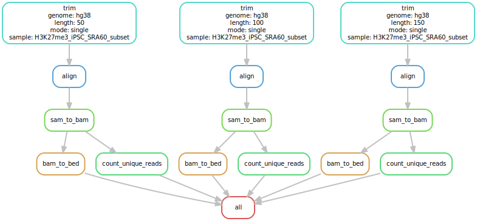
<figcaption aria-hidden="true">50_100_150_hg38_single</figcaption>
</figure>

<figure>
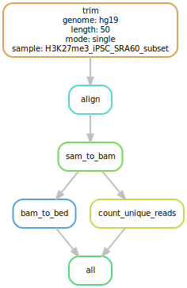
<figcaption aria-hidden="true">50_hg19_single</figcaption>
</figure>

<figure>
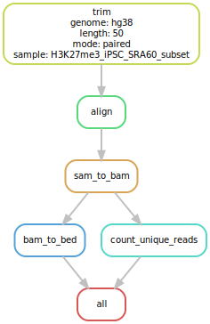
<figcaption aria-hidden="true">50_hg38_paired</figcaption>
</figure>

For full marks you will need: - One Snakefile - The ability to
alternatively run with either single or paired-end alignment mode (also
trimming the reads appropriately) - The ability to align to either hg19
or hg38 - The following outputs: trimmed fastq, sam, bam, bed, and
counts files for each run (not all of these need to be in the rule all
necessarily) - Different runs should not overwrite one another (i.e. the
output files should be named differently for each run)

You can use `snakemake -np` to perform a dry-run and debug your
snakefile. Once you are confident that your snakefile is working
correctly you can run it on the server. Run your snakefile using the
following command: `snakemake --cores 1 --resources mem_mb=4000`. Each
time modify the config file to change the parameters of your pipeline.
Once you have completed all of your runs (5 runs in total, remember that
snakemake, when configured correctly will not run redundant jobs) you
can move on to the next section.

**NOTE: Each run will take 15-20min to complete. Most of the time will
be taken up by the align rule which will run each time.** Please ensure
you start early.

### 3. Analyzing the results (18 pts)

#### a. Effect of read length on mappability

Download the count files generated by your various runs onto your
*local* computer into your A2 project folder. Once you have downloaded
the files you can begin your analysis in R.

\#?# 7. Plot the number of uniquely mapped reads for each read length (1
pt).

``` r
# Include the code you used to generate the plot in this block. When you knit your document the plot will be generated and displayed below.

data = data.frame(read_length = c(50, 100,150), counts = c(1401280, 1504718, 1571825))
bp = barplot(counts~read_length, data = data, main = "Effect of read length on uniquely-mapped read counts ")
```

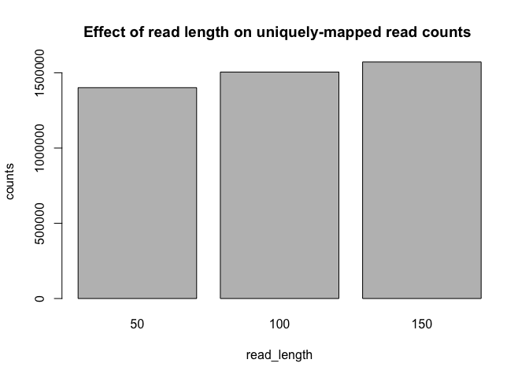<!-- --> \#?# 8. Based on
the results of your analysis, what is the relationship between read
length and mappability? Define the relationship mathematically (1 pts)

``` r
library(drc)
```

    ## Loading required package: MASS

    ## 
    ## 'drc' has been loaded.

    ## Please cite R and 'drc' if used for a publication,

    ## for references type 'citation()' and 'citation('drc')'.

    ## 
    ## Attaching package: 'drc'

    ## The following objects are masked from 'package:stats':
    ## 
    ##     gaussian, getInitial

``` r
x = c(0.0000001, 50, 100, 150)
y = c(0.0000001, 1401280, 1504718, 1571825)
linear_model = lm(y~x)
plot(x, y, xlab = "x", ylab = "y", main = "Linear Regression", pch = 16)
abline(linear_model, col = "red", lwd = 2)
```

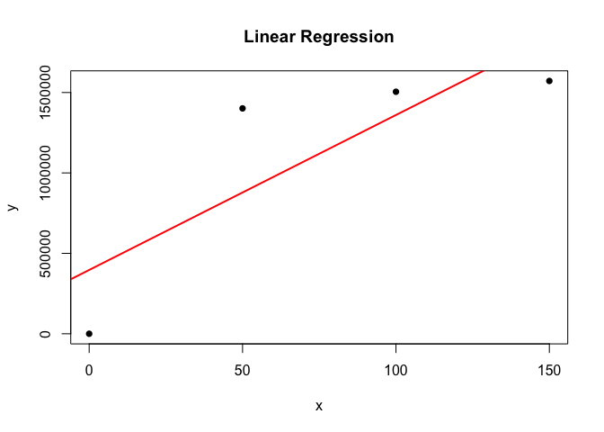<!-- -->

``` r
asym_model = drm(y ~ x, fct = AR.3())
plot(asym_model, log="", main = "Asymptotic Regression")
```

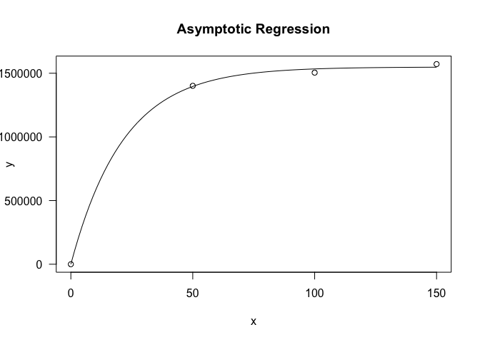<!-- -->

``` r
log_model <- lm(y~log(x))
plot(x, y, xlab = "X", ylab = "Y", main = "Log Regression", pch = 16)
abline(log_model, col = "red", lwd = 2)
```

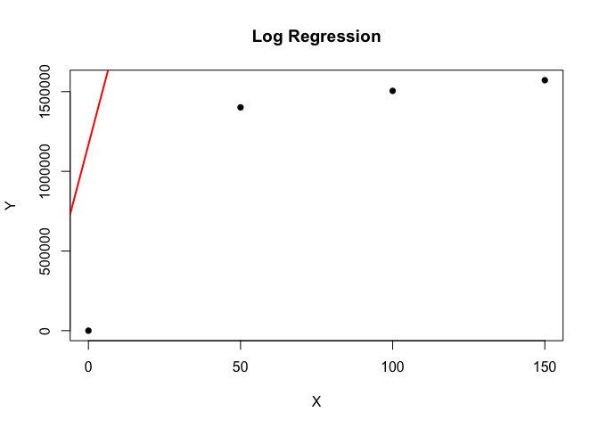<!-- -->

``` r
summary(asym_model)
```

    ## 
    ## Model fitted: Shifted asymptotic regression (3 parms)
    ## 
    ## Parameter estimates:
    ## 
    ##                 Estimate Std. Error t-value p-value  
    ## c:(Intercept) 2.1189e+02 3.8325e+04  0.0055 0.99648  
    ## d:(Intercept) 1.5489e+06 3.0917e+04 50.1001 0.01271 *
    ## e:(Intercept) 2.1583e+01 3.1436e+00  6.8658 0.09208 .
    ## ---
    ## Signif. codes:  0 '***' 0.001 '**' 0.01 '*' 0.05 '.' 0.1 ' ' 1
    ## 
    ## Residual standard error:
    ## 
    ##  38340.4 (1 degrees of freedom)

``` r
predict(asym_model, newdata = data.frame(x = 25))
```

    ## Prediction 
    ##    1062619

The above analysis demonstrates multiple models attempted to fit the
data at hand. We also make the assumption that if the mapping rate is
near 0bp, the number of uniquely mapped reads will also approach 0. For
instance, we would not expect a read of length 1 to uniquely map to the
ref genome, as an individual nucleotide will appear frequently in most
codons. With this assumption we see that the Asymptotic Regression model
fits the data the best with the least std and residual standard error.

citation: Some useful equations for nonlinear regression in R. (n.d.).
Www.statforbiology.com.
<https://www.statforbiology.com/nonlinearregression/usefulequations>

citation: R: Asymptotic regression model. (n.d.). Search.r-Project.org.
Retrieved January 27, 2024, from
<https://search.r-project.org/CRAN/refmans/drc/html/AR.html>

    #?# 9. What would you predict the number of uniquely mapped reads would be for a 25bp read? What assumptions are you making in your prediction? (2 pt)
    # HINT: Think about what the result above would indicate for the mapping rate of a 0bp read. 

    Answer: We would predict 1062619 for 25bp read. We assume that the relation between read length and mappability follows an Asymptotic Regression model with the formula "f(x)=c+(d−c)(1−exp(−x/e))", where c = 2.1189e+02, d = 1.5489e+06, e = 2.1583e+01, as demonstrated previously.

#### b. Effect of reference genome on mappability

\#?# 10. Plot the number of uniquely mapped reads for each reference
genome (1 pt)

``` r
# Include the code you used to generate the plot in this block. When you knit your document the plot will be generated and displayed below.
data = data.frame(read_length = c("hg19", "hg38"), counts = c(1408007, 1401280))
bp = barplot(counts~read_length, data = data, main = "Effect of reference genome on uniquely-mapped read counts ")
```

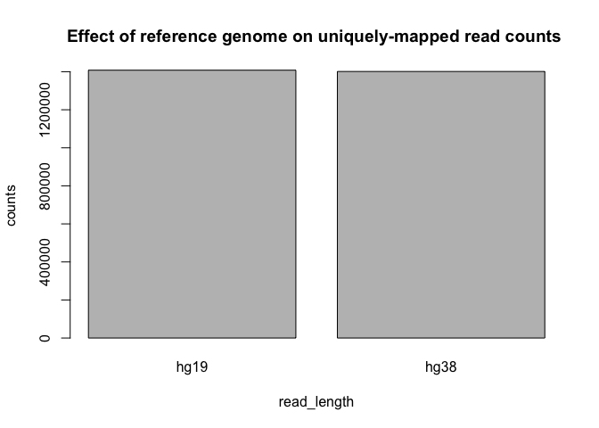<!-- -->

    #?# 11. Interpret the plot above, what does it tell you about the the hg19 and hg38 alignments? (1.5 pts)
    Answer: From the two datapoints, we see that the reference genome mapability counts are similar. However, hg38 has a lower count which can suggest more accurate representation of alignments, as hg38 is a larger dataset and it incorporates features such as alternating loci, which introduces more genetic diversity in the reference genome. 

Citation: ChatGPT(“why does hg38 has a lower uniquely mapped read count
than hg19”)

Next we will check to see not whether the number of uniquely mapping
reads has changed, but whether the reads are mapping to the same
location after lifting over and whether the alignment *quality* has
changed. In order to compare the positions/scores of reads we will have
to extract the relevant information from the bed files generated by the
pipeline. You can use the `join` command to merge the hg19_lifted_over
and hg38 bed files together. *Make sure that you sort your bedfiles by
**read name** before merging*. You can sort the bedfiles using the
`sort` command.

You only want to include these columns in your merged bed file:
`read_ID,chr_hg38,start_hg38,end_hg38,score_hg38,chr_hg19,start_hg19,end_hg19,score_hg19`
(hg19 refers to the lifted over file though its start and end
coordinates are technically referring to hg38 as well.) You should have
each of these columns *in the order specified*. You can use arguments of
the `join` command to modify which columns end up in the output and in
which order.

\#?# 12. Create a barchart illustrating the difference in mean alignment
score between the hg19 (lifted-over) and hg38 alignments for each of the
autosomal chromosomes (2 pts).

**<span style="color:red">Please note that the the following processing
steps cannot be done to all 1.8 million examples due to computational
constraints. 200,000 random examples are selected under the assumption
that the data is IID. </span>**

The below block was used to generate the mean_score object. It is
commented out to save time knitting the document. The mean_score was
saved to a scv instead.

``` r
# Include the code you used to generate the plot in this block. When you knit your document the plot will be generated and displayed below.

# merged <- read.table("merged.bed", quote="\"", comment.char="")
# merged = merged[sample(1:1867199, 200000, replace = FALSE),]
# colnames(merged) = c("read_ID","chr_hg38","start_hg38","end_hg38","score_hg38","chr_hg19","start_hg19","end_hg19","score_hg19")
# merged$cleaned_chr_hg38 = rep("other", length(merged$read_ID))
# merged$cleaned_chr_hg19 = rep("other", length(merged$read_ID))
# for (i in 150000:200000){ #length(merged$read_ID)
#   chr_38 = unlist(strsplit(merged$chr_hg38[i], split = "_"))[1]
#   if(grepl(".*\\b(chr[0-9]+).*", chr_38)){
#     merged$cleaned_chr_hg38[i] = chr_38
#   }
#   chr_19 = unlist(strsplit(merged$chr_hg19[i], split = "_"))[1]
#   if(grepl(".*\\b(chr[0-9]+).*", chr_19)){
#     merged$cleaned_chr_hg19[i] = chr_19
#   }
#   print(i)
# }
```

``` r
# Include the code you used to generate the plot in this block. When you knit your document the plot will be generated and displayed below.

#mean_score = data.frame(chr = sort(unique(merged$cleaned_chr_hg19)), hg19 = rep(0, 23), hg38 = rep(0,23))
# for (i in 1:23){
#   mean_score$hg19[i] = mean(merged$score_hg19[which(merged$cleaned_chr_hg19 == mean_score$chr[i])])
#   mean_score$hg38[i] = mean(merged$score_hg38[which(merged$cleaned_chr_hg38 == mean_score$chr[i])])
# }
mean_score = read.csv("mean_score.csv", row.names = NULL)
barplot(t(abs(mean_score$hg19-mean_score$hg38)), names = mean_score$chr, beside = TRUE, legend.text = TRUE, main = "Difference in mean alignment score between the hg19 and hg38", xlab = "Autosomal chromosomes", ylab = "Mean alignment score", las = 2)
```

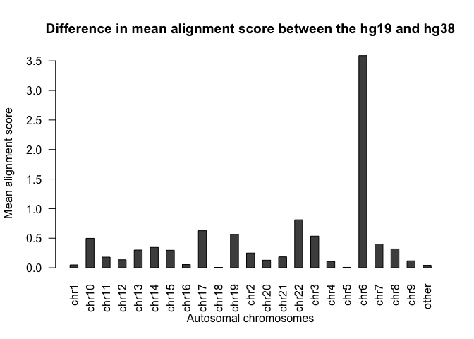<!-- -->

``` r
barplot(t(as.matrix(mean_score[,2:3])), names = mean_score$chr, beside = TRUE, legend.text = TRUE, main = "Mean alignment score for hg19 and hg38", xlab = "Autosomal chromosomes", ylab = "Mean alignment score", las = 2, col = c("green", "purple"))
```

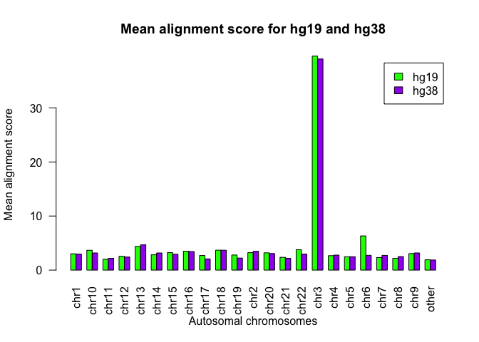<!-- -->

    #?# 13. Interpret the plot you created in Q11 above. What do you notice, explain why you think the plot looks the way it does. (3 pts)

    Answer: I noticed that the difference in mean alignment score for chromosome 6 is much higher than any other chromosomes, chr6_hg39_score = 2.736029, chr6_hg19_score = 6.325203. The plot shows that for the same sample, the reads that align to hg38-chr6-equivalent genome positions on hg19 has a higher score. This may suggest that the sample's read on chromosome 6 is most similar to hg19 so that the algorithm is more confident in predicting their location on hg19 than hg38. However, we should also recognize that the second plot indicates that the both hg19 and hg38 has relatively low mean alignment scores for all chromosomes except chr3, indiciating that we are not confident in any alignment other than chr3 for both reference genomes. 

    #?# 14. Create a boxplot illustrating the *difference* in start position of reads between the hg19 (lifted-over) and hg38 alignments for each of the autosomal chromosomes (2 pts)

``` r
# Include the code you used to generate the plot in this block. When you knit your document the plot will be generated and displayed below.

#diff_start = data.frame(chr = sort(unique(merged$cleaned_chr_hg38)), diff =rep(0, 23))
#for (i in 1:23){
#   diff_start$diff[i] = abs(mean(merged$start_hg38[which(merged$cleaned_chr_hg38 == diff_start$chr[i])] - merged$start_hg19[which(merged$cleaned_chr_hg38 == diff_start$chr[i])]))
# }
diff_start = read.csv(file = "diff_start.csv", row.names = NULL)
barplot(t(diff_start$diff), names = diff_start$chr, beside = TRUE, legend.text = TRUE, main = "Difference in mean start position between the hg19 and hg38", xlab = "Autosomal chromosomes", ylab = "absolute difference in start position", las = 2)
```

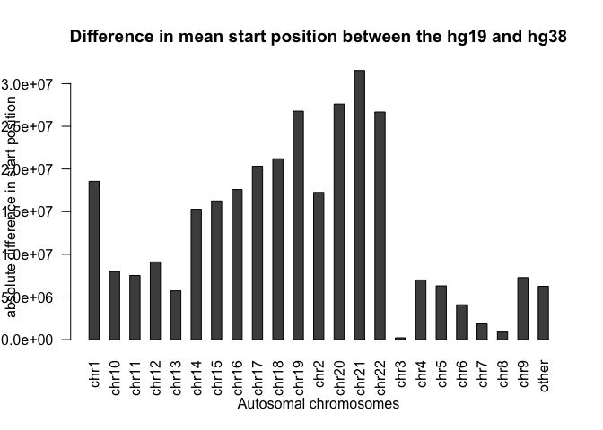<!-- -->

``` bash
#?# 15. Which chromosomes have the smallest difference(s) in start position between the hg19 and hg38 alignments? Why do you think this is? (2.5 pts)
Answer: CHromosome 3 has the smallest differences in start position between hg19 liftover and hg38. This suggests that the reads that aligned to chromosome 3 aligned to the same equivalent locations of hg19 liftovered coordinate and actual hg38 coordinates. The fact that chromosome 3 also have the highest mean alignment score for both reference genomes also shows that the the reads appeared on chr3 are most likely from chromosome 3. 
```

#### c. Effect of alignment mode on mappability

\#?# 16. Plot another barchart comparing the number of uniquely mapped
reads for each alignment mode (1 pt)

``` r
data = data.frame(read_length = c("single", "paired"), counts = c(1401280, 2868798))
bp = barplot(counts~read_length, data = data, main = "Effect of reference genome on uniquely-mapped read counts ")
```

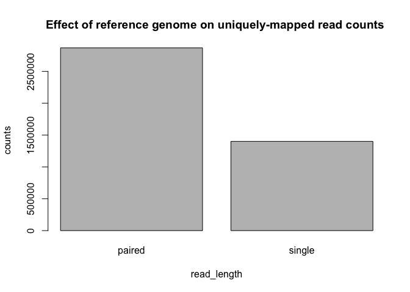<!-- -->

``` bash
#?# 17. As we saw before, the read length was directly related to the number of uniquely mapped reads in a single-end alignment. Do you expect a *similar* relationship (i.e. direction and rough size of slope) exists for paired-end alignments? Why or why not? (1 pt)

Answer: We expect a similar direction, but different model or slope. Paired-end alignment is more complex with more factors at play. With sequences from both ends, the algorithm has more ability than single-end sequencing to place the reads to their correct location on the reference genome and more confident on which fragment it comes from and where this fragment belongs. 
```

Citation: ChatGPT(“For paired-end, does read length positively correlate
to mapability”)

## Discussion (8 pts):

    #?# 18. Assuming a random background genome, derive a relationship between the length of a read and the probability that it will map to a unique location in the genome. Show your work. (1 pts)
    Answer: 
    The following represents the scenarios that we do not meet the criteria. 
    Let A_n = quantity of segments which contain n-elements (A or C or T or G), which terminates in a A
    C_n = quantity of segments which contain n-elements (A or C or T or G), which terminates in a C
    T_n = quantity of segments which contain n-elements (A or C or T or G), which terminates in a T
    G_n = quantity of segments which contain n-elements (A or C or T or G), which terminates in a G

    let a read length be L and a read terimates in "G"

    let A_{n} = A_{n-1} + C_{n-1} + T_{n-1} + G_{n-1}
        C_{n} = A_{n-1} + C_{n-1} + T_{n-1} + G_{n-1}
        T_{n} = A_{n-1} + C_{n-1} + T_{n-1} + G_{n-1}
    let G_{n} follow the read's sequence such that if the read is "ACTCG"
    then G_{n} = A_{n-4} + C_{n-3} + T_{n-2} + C_{n-1}

    --> construct a table of [A_n, C_n, T_n, G_n]all the way to N = length of genome. 
    --> The possibility will be deonted as 1 - ( (A_n+C_n+T_n+G_n) / 4^N ) 

Citation: what is the probability of three CONSECUTIVE heads on ten
tosses of a fair coin.? (n.d.). Mathematics.science.narkive.com.
Retrieved January 28, 2024, from
<https://mathematics.science.narkive.com/EAi37hC7/what-is-the-probability-of-three-consecutive-heads-on-ten-tosses-of-a-fair-coin>

    #?# 19. Would all 20bp sequences be expected to map to a random genome with equal frequency? Why or why not? (1 pt)

    Answer: No, they would only map with equal frequency if the genetic diversity present in a random genome and the 20bp sequences coincides. Since individual genomes do not always incorporate regions to allow for variants, for instance there is a large difference in the inclusion of new alternative loci sequences between hg19 and hg38, then variances may not map to the same genome as well as other more common sequences.

    #?# 20. Would the difference between SE and PE alignment remain the same if you had used the 150bp reads? Why or why not? (2 pts)
    Answer: The single ended alignment would likely improve as the length would allow for better mapping accuracy and consequently higher uniquely mapped reads. This difference in bp reads could lead to less of a difference between the read count scores of SE and PE. However, the paired end generally allows for better mapping and the addition of length would help improve that mapping. Therefore, if length plays a larger role in alignment accuracy, the difference
    between SE and PE unique reads would decrease, but if length plays a smaller role, the difference would remain the same.

    #?# 21. Trimmomatic can also be used to trim reads based on their quality score. What impact will trimming reads according to read quality to have on alignment/mapping? Use evidence from your data to test your hypothesis. (4 pts)
    Answer: Hypothesis is Trimming based on their quality score indicates higher alignment accuracy. As previously shown, the reads aligned to hg19 and hg38 both have high mean alignment score on chromosome 3 and then we see that the mean difference between starting position is also at minimum on chromosome 3, indicating that alignment was done with highest accuracy. 

# Contributions

Please note here the team members and their contributions to this
assignment.

Leon Li: 23341381

Emily Flaschner: 26576629

(All members worked together on all questions. The set-up was done
individually.)
