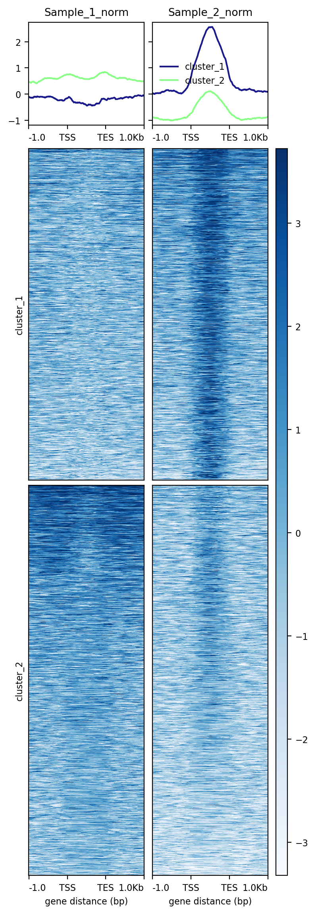

BMEG 424 Assignment 3
================

- [BMEG 424 Assignment 3: ChIP-seq](#bmeg-424-assignment-3-chip-seq)
  - [Introduction:](#introduction)
    - [Goals and Objectives](#goals-and-objectives)
    - [Data](#data)
    - [Software and tools](#software-and-tools)
    - [Other notes:](#other-notes)
    - [Submission:](#submission)
  - [Experiment and Analysis:](#experiment-and-analysis)
    - [1. ChIP-seq](#1-chip-seq)
    - [2. Exploratory analysis with IGV (8
      pts)](#2-exploratory-analysis-with-igv-8-pts)
    - [3. Peak calling (5.5 pts)](#3-peak-calling-55-pts)
      - [a. Peak calling with macs2](#a-peak-calling-with-macs2)
      - [b. Peak enrichments](#b-peak-enrichments)
- [Discussion (6 pts)](#discussion-6-pts)

``` r
knitr::opts_chunk$set(echo = TRUE)
```

# BMEG 424 Assignment 3: ChIP-seq

## Introduction:

### Goals and Objectives

The aim of this assignment is to familiarize you with the processing and
analysis of ChIP-seq data. You worked on processing and aligning
ChIP-seq data in the previous assignment but you might be a little
confused about what to do after the alignment. This assignment’s main
aim is to walk you through a ChIP-seq pipeline **post-alignment**. You
will be analyzing 3 different histone modification marks (H3K27me3,
H3K4me3 and H3K27ac). In order to identify the enrichments for each
epigenetic mark, we also need to use the *input* which represents the
DNA content of the sheared chromatin sample prior to
immunoprecipitation.

### Data

All the files can be found under the following path:
**/projects/bmeg/A3/** . The files belong to one of four categories:

- H3K27me3

- H3K4me3

- H3K27ac

- input (input_chr3_subset.bam)

Unfortunately for you, as you can see from the file names (other than
input_chr3_subset.bam) the sequencing center has mixed up your samples,
they are labelled Sample_1, Sample_2 and Sample_3. As part of this
assignment you will work on identifying which sample corresponds to
which epigenetic mark is which by analyzing the files.

### Software and tools

We will be using a couple of new tools this time. Before we move on to
the practical part, make sure you have them all installed.

- Integrative Genomics Viewer (IGV): Interactive tool to visualize
  different data types of genetic information (e.g. bam, bed files).
  After assignment 1 you should have this installed on your **local
  computer**. To visualize where the reads of our ChIP analysis mapped
  in the genome. To install it, follow the instructions on this website:
  *<https://software.broadinstitute.org/software/igv/home>*

- Deeptools (<https://deeptools.readthedocs.io/en/develop/index.html>):
  Software to analyze high-throughput data that allows to create easy to
  visualize figures. This will be installed on the server as part of
  your conda environment.

- macs2
  (<https://github.com/macs3-project/MACS/blob/master/docs/callpeak.md>):
  Tool to capture enrichments of ChIP-seq analysis. This will be
  installed on the server as part of your conda environment.

### Other notes:

- As always you must cite any sources you use in your assignment (class
  slides are exempted). This includes any code you use from
  StackOverflow, ChatGPT, Github, etc. Failure to cite your sources will
  result in (at least) a zero on the assignment.

- When you begin your assignment do not copy the data from
  `/projects/bmeg/A3/` to your home directory. You can use the files in
  the projects folder without modifying them. Remember to output any
  files you create in your home directory *and not in the projects
  directory*. You should gzip files while you are working on the
  assignment and remember to delete files you no long need. If you take
  up too much space in your home directory you will not be able to save
  your work and will prevent others from doing the same, you will also
  make TA Omar very unhappy :(

### Submission:

Submit your assignment as a knitted RMarkdown document. *Remember to
specify the output as github_document* You will push your knitted
RMarkdown document to your github repository (one for each group).
Double check that all files (including figures) necessary for your
document to render properly are uploaded to your repository. You will
then submit the link, along with the names and student numbers of all
students who worked on the assignment to the assignment 3 page on
Canvas. Your assignment should be submtited, and your last commit should
be made, before 11:59pm on the day of the deadline. Late assignments
will will be deducted 10% per day late. Assignments will not be accepted
after 3 days past the deadline.

## Experiment and Analysis:

### 1. ChIP-seq

ChIP-seq experiments work by pulling down DNA fragments which are bound
by a particular protein. The DNA fragments are then sequenced and
aligned to the genome. The number of reads in a given position is
proportional to the amount of DNA that was pulled down with the protein
of interest (ex. H3K27me3). However, the number of reads is also
dependent on the amount of DNA that was sequenced at that locus. This
means that if you have a sample with a lot of DNA, you will have more
reads than a sample with less DNA. To account for this, we normalize the
ChIP signal by the input signal. This gives us a normalized ChIP signal
that we can use to perform analyses.

### 2. Exploratory analysis with IGV (8 pts)

These histone modifications mark states of active (H3K27ac, H3K4me3) or
inactive (H3K27me3) gene transcription and have different coverage of
the genomic region where they are located. To better visualize the
differences, we will create bigWig files from previously aligned,
filtered and indexed bam files. BigWig files are indexed, compressed
files that can be used to **visualize** signals across the genome. Here,
we will be using them to graph the coverage across the genome. We will
be creating our bigWig files using the bamCoverage tool from the
[deepTools
suite](https://deeptools.readthedocs.io/en/develop/content/tools/bamCoverage.html).

``` bash
Below is the command for converting the input DNA data into a bigWig file using the bamCoverage tool from the deepTools suite. 
"""
bamCoverage \
-b input_chr3_subset.bam -o \
input_chr3_subset.bw -p 2
"""

#?# 1. Create a generalized snakemake rule for converting any bam file into a bigWig file using the code above (0.25pts) and explain why we are including the -p 2 flag (0.25pts).


rule bigWig
    input: 
        bam = "/path/to/data/{sample}.bam",
    output: 
        bigWig = "bigWig/{sample}.bw",
    shell: 
        "bamCoverage -b {input.bam} -o {output.bigWig} -p 2"
        
# "-p 2" means using 2 processors for this bamCoverage command
```

Citation: ChatGPT: “What does the -p mean in bamCoverage”

Process all of the bam files in the directory `/projects/bmeg/A3/bam/`
into bigWig files. **Remember to make the bigWig files in your home
directory and NOT in the projects directory**. Whether you choose to do
this manually (by directly running the command four times) or with your
one-step “pipeline” is up to you. Once you’re done download the bigWig
files and load them into IGV. Load all the bigwig signal track files
(*Tip: you can use the “File” tab to “load from file” option to choose
the files from your computer at once*) onto IGV on your local computer,
select the “autoscale” option for each file on their individual tracks.
Use the hg38 reference genome (selectable within IGV) to visualize the
bigWig files.

Navigate to the following region: `chr3:93,432,899-93,508,213` and take
a screenshot of your IGV session.

    #?# 2. Include your screenshot below using Rmarkdown syntax (0.5pts )

<figure>

<figcaption aria-hidden="true">IGV_sc</figcaption>
</figure>

    #?# 3. What do you see? Is there anything peculiar about the signals at this locus? Explain what you think is causing the effect you see and how you could confirm your hypothesis (1.5pts) 
    # HINT: Sometimes track signal will be truncated to a pre-set maximum. If you right-click the track label (left) and select "autoscale", it will automatically adust the scales of the track to the range of your data. Try playing around with the track settings to see their effect.

|                                                                                                                                                                                                                                                                                                                                                                                                                                                                                                                                                                                                                                                                                                                                                                                                                                                                                                                                                                                             |
|---------------------------------------------------------------------------------------------------------------------------------------------------------------------------------------------------------------------------------------------------------------------------------------------------------------------------------------------------------------------------------------------------------------------------------------------------------------------------------------------------------------------------------------------------------------------------------------------------------------------------------------------------------------------------------------------------------------------------------------------------------------------------------------------------------------------------------------------------------------------------------------------------------------------------------------------------------------------------------------------|
| Answer3: When the signals are normalized, the peak in the input file is present in every sample file at the same genome location. When comparing within each sample, (seeing the peak in input file as the reference, even though the intensity of this peak is different across samples), sample 1 has a lot more and more intense smaller peaks present in the region `chr3:93,432,899-93,508,213`. The peculiar thing about the signals is that the peak signal present in the input file, which has max intensity of 23152 only has intensity `{"sample1: 147"; sample2: 90; sample3: 334}` which is much smaller than the intensity of the input file. One possible explanation is as mentioned before, “if you have a sample with a lot of DNA, you will have more reads than a sample with less DNA”. The input batch may just have a lot more DNA to start with than the samples. This can be confirmed by deducing the total number of mapped bases for the input and sample data. |

For your convience we normalized bigWig track files for each of the
histone modifications using the input. These files are located in the
directory `/projects/bmeg/A3/bigWig_norm`. We are going to use these
normalized bigWig files for most of our further analysis.

While exploring the bigwig files of the epigenetic marks on IGV, you
probably noticed that they can look very different from each other and
some of them ressemble the input more closely than others. Different
epigenetic marks can have very different signatures based on their
distribution patterns across the genome.

ChIP-seq reads cluster together in high density regions called peaks.
These peaks peaks can look different depending on what sort of protein
you are pulling down in your experiment. Certain well-characterized
epigentic marks are broadly classified as either active or repressive
marks and we can differentiate them by visualizing their peaks.

The deepTools **computeMatrix reference-point** command calculates
scores to represent the reads mapping to specified regions of the genome
across different files. We will use these matrices to compute heatmaps
which will allow us to visualize the peaks of each epigenetic mark in
our experiment at certain genes of interest.

Specifically, we will use the genes located in the `reference_genes.bed`
file which is located `project/bmeg/A3` directory. This file contains
the coordinates of genes for which we want to understand

``` bash
#?# 4. Use computeMatrix to compute a matrix for the signal tracks for each histone modification outlined above (which we will use to create a plot in the following step), with the following criteria: 

## - Use the regions in reference_genes.bed located under the /projects/bmeg/A3/ directory as the basis for the plot.
## - Include the surrounding regions; 1kb upstream and 1kb downstream
## - Use all 3 input-normalized bigWig files as signal tracks (i.e. one command for all 3 marks)
## - Ensure all regions in bigWig files are are size-equalized/scaled when computing the matrix 
Write the command you used to run it below (1 pts)

computeMatrix scale-regions \
-R /projects/bmeg/A3/reference_genes.bed \
-S /projects/bmeg/A3/bigWig_norm/Sample_1_norm.bw \ /projects/bmeg/A3/bigWig_norm/Sample_2_norm.bw \ /projects/bmeg/A3/bigWig_norm/Sample_3_norm.bw \
-o matrix.gz \
--upstream 1000 \
--downstream 1000
```

Now that the scores matrix has been computed we can use it to create a
heatmap to visualize the distribution of reads at our reference genes.
We will use the deepTools \*\* plotHeatmap \*\* function to create a
heatmap following this criteria:

``` bash
#?# 5. Use the deepTools ** plotHeatmap ** function to create a heatmap following this criteria (1 pts) 
- Use the matrix from the previous point
- Use the Blues colormap
- Create 3 clusters within the heatmap according to the patterns of the reads distrubution across the files using heirarchical clustering

plotHeatmap -m matrix.gz -o heatmap.png --colorMap Blues --kmeans 3
```

    #?# 6. Explain what you are looking at (Axes, colours, curves) (1 pts)

    -----------------------------------------------------
    Answer: The heatmap has the first row of line plots that represents the intensity of each of the 3 clusters within each sample. The x-axis represents the gene region of each sample including 1000bp upstream and downstream. TSS stands for transcrpition start site and TES stands for transcription end site. The y-axis is the signal intensity. In the bottom heatmaps, the more blue it is the more intense the sigals is. The x-axis for the heatmap is the same as the profile plot. Within each column, there are three heatmaps, each represent signals that belong to each cluster. The [0,0] heatmap represents the sigals of cluster 1 within sample 1 and vice versa. 

    Citation: ChapGPT: "Can you tell me how I should interpret a heatmap made by plotHeatmap"
    Citation: “Normalization of PlotHeatmap · Issue #824 · Deeptools/DeepTools.” GitHub, github.com/deeptools/deepTools/issues/824. Accessed 3 Feb. 2024.
    -----------------------------------------------------
    #?# 7. Is this plot helpful for distinguishing between the different epigenetic marks? Why or why not? (1 pts)

    -----------------------------------------------------
    The plot provides sufficient evidence to infer the different epigentic marks. Sample 3 has both cluster 1 and 2 with very high intensity and cluster 2 peaks outside the transcription region (TSS-TES). Research shown that H3K27ac marks active promoters and enhancers, indiciating that two regions of DNA would be pulled down and present as two peaks within the data. Furthermore, compare to sample 2, the shape and location of both cluster 1 and 2 lines are quite similar. The only difference is the general scale or intensity of the two lines (Sample 2 has weaker signals for cluster 1 and 2). This proofs that sample 2 is the promotor, initiating the transcription, whereas sample 3 is the enhancer, marking both the promotor and enhancer region and at the same time enhancing the sigal (taller peaks). By this logic sample 1 would be H3K27me3. Nevertheless, the above is inference only and the visualizations does not indicate any downregularization of other regions. 

    Citation: Zhou, C., Halstead, M. M., Bonnet-Garnier, A., Schultz, R. M., & Ross, P. J. (2022). Resetting H3K4me3, H3K27ac, H3K9me3 and H3K27me3 during the maternal-to-zygotic transition and blastocyst lineage specification in bovine embryos. https://doi.org/10.1101/2022.04.07.486777
    -----------------------------------------------------

    #?# 8. Include the plot produced by plotHeatmap below using Rmarkdown syntax (0.5 pts)

    **Add screenshot here:**

<figure>

<figcaption aria-hidden="true">heatmap</figcaption>
</figure>

    #?# 9. The above heatmap was made with the ratio of ChIP to input. Repeat the process above, but this time using the raw bigwig files (not input-normalized). 
    # Include a IGV screenshot of this analysis, below this code block. (0.25 pt)
    # How does this compare to the input-normalized data? Why do you think this is? (1pt)

    -----------------------------------------------------
    Answer: The result is expected and the visualizations are harder to read. Since this is without normalization, the maxmum value is quite high for sample 1 and [cluster3, sample1] is complelely white and the trend lines within the profile plot is difficult to deduce. Cluster 1's line is much stronger than the others ones in sample 2 and 3 and its peak intensity is much higher than others. This makes the difference between cluster 2 and cluster 3 much hard to distinguish. This is mainly due to not having the matrix generated after normalization. The samples are on different ranges of scale. 
    -----------------------------------------------------

**Add screenshot here:** 

### 3. Peak calling (5.5 pts)

#### a. Peak calling with macs2

Now we want to identify enriched regions of the genome for each of our
three histone marks. Instead of visualizing the simple distribution of
reads we want to quantitatively define enriched regions or “peaks”. In
order to get the enrichments, we will run the **macs2** program to call
the peaks for each epigenetic mark.

``` bash
#?# 10. Type a *generalized* command (note: not a snakemake rule) for calling peaks on your bam files using macs2, using the input file as a control (0.25 pts)
## Tip: Make sure to read the documentation (using the -h flag) for the *masc2 callpeak* command

macs2 callpeak -t /path/to/bam/files.bam -c /path/to/input/file.bam> \
--outdir /output/directory/
```

**This processing has already been completed for you.** The appropriate
peak files are at `/project/bmeg/A3/*.peak`. You do not need to run the
generalized command you wrote above.

#### b. Peak enrichments

For this assignment, we are working with 3 different epigenetic marks:
H3K4me3, H3K27me3 and H3K27ac. We want to differentiate between these
marks by comparing the relative position of the peaks called for each of
them. In order to do this we will be creating a similar heatmap to the
one we created above, but this time we will be visualizing the peaks
against the read distributions of the other marks, instead of a set of
reference genes. (i.e. H3K4me3 peaks vs H3K27me3 peaks vs H3K27ac
peaks).

``` bash
Create 3 heatmaps following the specifications you used on part 2. In each heat map, ONE of the samples .peak files should be used as the reference file while the bigWig files of the other two samples should be used as the score files. This way you get three matrices which compare the peaks of each epigenetic mark to the reads of the other two marks. 
#?# 11. Write the commands you used to compute the matrices: (0.75 pts)

computeMatrix scale-regions -R /projects/bmeg/A3/peak/Sample_3_chr3_subset_ChIP_peaks.peak -S /projects/bmeg/A3/bigWig_norm/Sample_1_norm.bw /projects/bmeg/A3/bigWig_norm/Sample_2_norm.bw -o matrix_sample3.gz --upstream 1000 --downstream 1000

computeMatrix scale-regions -R /projects/bmeg/A3/peak/Sample_2_chr3_subset_ChIP_peaks.peak -S /projects/bmeg/A3/bigWig_norm/Sample_1_norm.bw /projects/bmeg/A3/bigWig_norm/Sample_3_norm.bw -o matrix_sample2.gz --upstream 1000 --downstream 1000

computeMatrix scale-regions -R /projects/bmeg/A3/peak/Sample_1_chr3_subset_ChIP_peaks.peak -S /projects/bmeg/A3/bigWig_norm/Sample_2_norm.bw /projects/bmeg/A3/bigWig_norm/Sample_3_norm.bw -o matrix_sample1.gz --upstream 1000 --downstream 1000
```

Next you’ll want to create the heatmaps using the matrices you just
created. You want three heatmaps (one for each matrix created in Q11).
Use the same parameters you used in Q5 (Part 2).

``` bash
#?# 12. Write the commands you used to create the heatmaps: (0.75 pts)

plotHeatmap -m matrix_sample3.gz -o heatmap_sample3.png --colorMap Blues --kmeans 3

plotHeatmap -m matrix_sample2.gz -o heatmap_sample2.png --colorMap Blues --kmeans 3

plotHeatmap -m matrix_sample1.gz -o heatmap_sample1.png --colorMap Blues --kmeans 3
```

    #?# 13. Add screenshots of the 3 heatmaps you got using the epigenetic marks' peak files as reference files. Add them after this code chunk in the following order: Sample_1, Sample_2, Sample_3 (the plot where Sample_1 was used as the reference file is the Sample_1 plot.) (0.75 pts)

**Add screenshot here:** 



    #?# 14. Do you see an overlap between the peaks of different epigenetic marks? Which epigenetic marks? (1 pt)

    -----------------------------------------------------
    Yes, within enhanced regions of sample 3, sample 2 exhbits a high-intensity peak within the transcription region. With enhanced region of sample 2, sample 3 exhibits a high-intensity peak within the transcription region. 
    -----------------------------------------------------

    #?# 15. Why do you think these epigenetic marks overlap? (2 pt)
    -----------------------------------------------------
    H3K27ac associates with enhancer & promoters, and H3K4me3 associates with promoter, which both contribute to active transcription. When H3K27ac marks a enhancer it can interact with a promoter and enhance the transcription. This may be the enhanced regions of H3K27ac are also where H3K4me3 peaks. So both sample 2 and 3 "support" each other, when each sample marks their region, both of the sample's enhanced region become enhanced and produces a peak. 
    -----------------------------------------------------

# Discussion (6 pts)

    #?# 16. Based on the sum of your analyses which file do you believe is the H3K27me3 sample? Why? (1 pts)
    -----------------------------------------------------
    Based on our previous analysis, H3K27me3 corresponds to sample 1. H3K27me3 is a repressive modification which would result in  limited expression that can be observed in the previous sample 1 heatmaps. When our sample of interest is 1 and the reference regions are sample 2 or 3, we do not observe any peaks which also fits characteristics similar to inhibition. We can therefore associate the H3K27me3 sample with sample 1.

    Citation: Zhou, C., Halstead, M. M., Bonnet-Garnier, A., Schultz, R. M., & Ross, P. J. (2022). Resetting H3K4me3, H3K27ac, H3K9me3 and H3K27me3 during the maternal-to-zygotic transition and blastocyst lineage specification in bovine embryos. https://doi.org/10.1101/2022.04.07.486777
    -----------------------------------------------------

    #?# 17. Can you distinguish between the H3K4me3 and H3K27ac samples from the analyses you did above? (1 pt)
    -----------------------------------------------------
    If yes, how can you tell? If not, describe (in detail) the analysis you would perform on the files to determine which is which. Remember to cite your sources (4 pts).

    Yes, sample 2 is H3K4me3 and sample 3 is H3K27ac. The first heatmap produced for question 5 provided strong evidence as sample 3 clusters 1 and 2 have higher intensity peaks than sample 2, illustrating enhanced transcription activities. This suggests that sample 3 is acting as an enhancer whereas, sample 2 has standard promoter expression. Furthermore, when comparing sample 2 using sample 3 as a reference, we see peaks in both clusters whereas the opposite analysis only results in one cluster containing a peak. This could suggest that sample 3 contains a reference for a promoter and enhanced transcription (hence peaks in both clusters), whereas sample 2 does not have a reference for the enhancer present in sample 3 which is why we have a single peak (only the promoter section is similar). Question 15 also further confirmed the communicative relation between the two samples. For more detail, please refer to the analysis conducted in question 5 and question 15. 

    Citation: Zhou, C., Halstead, M. M., Bonnet-Garnier, A., Schultz, R. M., & Ross, P. J. (2022). Resetting H3K4me3, H3K27ac, H3K9me3 and H3K27me3 during the maternal-to-zygotic transition and blastocyst lineage specification in bovine embryos. https://doi.org/10.1101/2022.04.07.486777
    -----------------------------------------------------
