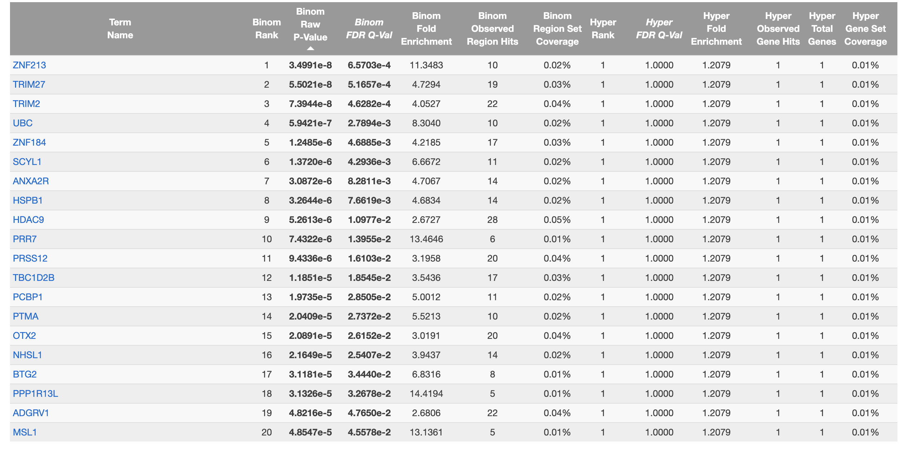
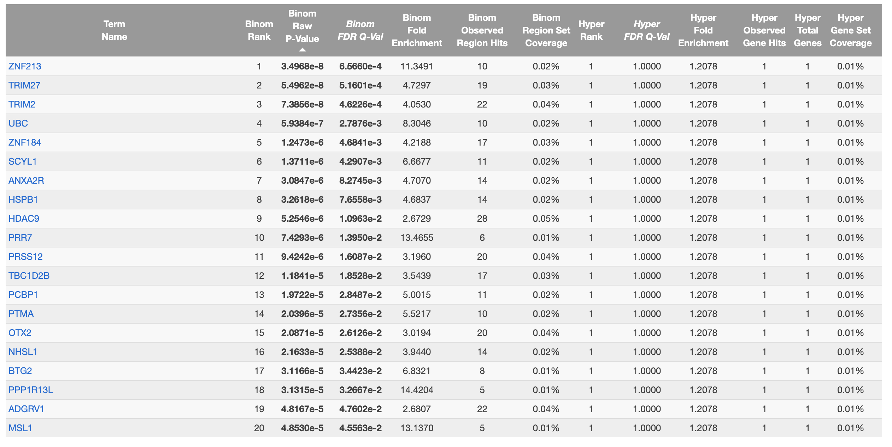

```{r setup, incldue=FALSE}
knitr::opts_chunk$set(echo = TRUE)
```
# BMEG 424 Assignment 4: ATAC-seq
## Introduction:
### Goals and Objectives
The goal of todays assignment is to familiarize you with ATAC-seq data. You recently learned about ATAC-seq in class and how it can be used to understand DNA accessibility across different genomic regions and under different conditions. In the last assignment we mainly focused on processing our ChIP-seq data (ex. calling peaks) and some simple analysis on processed data which could be used to understand the nature of the data and experiments they came from. 

In this assignment we will be working with ATAC-seq data files which have been almost completely processed and will instead focus much more on the analysis of the data (instead of processing).

### Data
The data for todays assignments are located at `/projects/bmeg/A4/`. None of your processing needs to be done on the server today so you should be able to download the file (yes, singular!) directly to your local machine. 

### Software and tools
As stated above, your data is already processed so you will not need to use any of the command line tools used in the previous assignments. Instead, you will be using R and RStudio to perform your analysis. 
You will need to install a few packages to your R environment to complete this assignment. You may have some of these installed from previous assignments, if not install them now. The packages are: 

- [tidyverse](https://www.tidyverse.org/) (includes tidyr, dplyr, ggplot2, etc.)
  
- [edgeR](https://www.bioconductor.org/packages/devel/bioc/vignettes/edgeR/inst/doc/edgeRUsersGuide.pdf)

- [GenomicRanges](https://bioconductor.org/packages/devel/bioc/vignettes/GenomicRanges/inst/doc/GenomicRangesIntroduction.html)

- [Biostrings](https://bioconductor.org/packages/devel/bioc/manuals/Biostrings/man/Biostrings.pdf)

- [csaw](https://bioconductor.org/packages/release/bioc/html/csaw.html)

- [gridExtra](https://cran.r-project.org/web/packages/gridExtra/index.html) (only needed for the MA plots)
  
### Submission
Submit your assignment as a **knitted** RMarkdown document. *Remember to specify the output as github_document* You will push your knitted RMarkdown document to your github repository (one for each group). Double check that all files (including figures) necessary for your document to render properly are uploaded to your repository. 

You will then submit the link, along with the names and student numbers of all students who worked on the assignment to the assignment 3 page on Canvas. Your assignment should be submitted, and your last commit should be made, before 11:59pm on the day of the deadline. Late assignments will will be deducted 10% per day late. Assignments will not be accepted after 3 days past the deadline.

## Experiment and Analysis:
### 1. ATAC-seq 
Our data for this assignment comes from a study which examined the effect of pharmacological inhibition of the BAF chromatin-remodelling complexes. Mutations in these complexes are often associated with drastic changes in chromatin accessibility and, as a result, cancer formation. In the study, the authors used drugs to mimic the effects of these cancer-associated mutations and measured the effect on chromatin accessibility using ATAC-seq. 

### 2. Exploratory Data Analysis and QC
#### a. Load and reformat data 
Download the data file from `/projects/bmeg/A4/` and load it into R using `read.table`, the code for this is provided below:
```{r}
# Read in gzipped file from working directory
downloaded_file_path <- "count_matrix_raw_atac_BRM014_ACBI1.csv.gz"
atacSeqData <- read.table(gzfile(downloaded_file_path), sep = ",", stringsAsFactors = FALSE, header = TRUE)
```

You can use `head` and `tail` to look at the first and last few rows of the data. 

```{r}
head(atacSeqData)
tail(atacSeqData)
```

You can use the `dim` function to see the dimensions of your data, and the `names` function to see the column names. 
```{r}
dim(atacSeqData)
names(atacSeqData)
```

Assuming you have not somehow messed up the download, you should have a data frame with 25 columns and 56617 rows. The first column is the genomic region while the other columns are different experiments that were carried out. Your columns should be formatted like this:

```
R1_24h_DMSO
```

Here, R1 represents the replicate number (each experiment was run in duplicate), 24h represents the time point (the effect of the different drugs tested was measured at multiple time points) and DMSO represents the drug used. There are two different drugs used in this study, BRM014 (labelled "N" in our data file) and BI_protac, DMSO is one of the control conditions (there is another control condition with no drug added labelled "control"). This means that there are 4 different conditions in this study: BRM014, BI_protac, DMSO and control. **You'll want to rename all of your columns which currently include "N" to include "BRM014" instead, as it will make the rest of this assignment a lot less confusing.** Another good idea is to **rename "BI_protac" to "BI-protac"** to avoid confusion with the "_" delimiter that separates the replicate, timepoint and treatment.

```{r}
# rename rows with "N" to "BRM014"
colnames(atacSeqData) <- gsub("N", "BRM014", colnames(atacSeqData))
# rename rows with "BI_protac" to "BI-protac" to avoid confusion with the "_" delimiter
colnames(atacSeqData) <- gsub("BI_protac", "BI-protac", colnames(atacSeqData))
```

As you can see, the data are currently stored in "wide" format, where each column represents a different experiment. While this format is pretty intuitive for humans to read, it is not ideal for analysis. We will want to convert our data to "tidy" format where each row represents an individual observation (currently a single row in our data represents 24 different data points/observations). Our data will become much "longer" as we will have 24 rows for each row in our current data frame. After reshaping our current data frame, we will have 56617*24 = 1,358,808 rows and 5 columns. The data should look something like this:

```{bash, eval=FALSE}
region,replicate,timepoint,treatment,read_count
chr1:181169-181759,R1,24h,DMSO, 32
chr1:181169-181759,R1,24h,BRM014, 18

...


```

#?# 1. Format your data into tidy format like the example above (0.5 pts)
```{r}
library(tidyverse)
tidy_data <- atacSeqData %>%
  pivot_longer(cols = -region, names_to = "variable", values_to = "read_count") %>%
  separate(col = variable, into = c("replicate", "timepoint", "treatment"), sep = "_")
head(tidy_data)
```
Citation: "How to use tidyverse in R to transform dataframe in a way that we can convert 23 columns to 5."

#### b. Exploratory Data Analysis
#?# 2. In order to understand your data better create a heatmap of the read counts for each condition. (0.5 pts)
Have one subplot for each replicate, with timepoints on the y-axis, treatments on the x-axis, and tiles coloured by read count. You should include the number of reads on each tile as well.
Note that your heat-map should plot ALL possible permutations of replicate-timepoint-treatment, even if missing from the data file.
(Example: There is no R1_6h_DMSO column in the original data but that tile should exist in your plot) 
```{r}
timepoints = c("5min", "10min", "30min", "1h", "6h", "24h")
treatments = sort(unique(tidy_data$treatment), decreasing = T)
for (r in unique(tidy_data$replicate)){
  count = c()
  for (i in 1:length(timepoints)){
    for (j in 1:length(treatments)){
      t = sum(tidy_data$read_count[which(tidy_data$replicate == r & tidy_data$timepoint == timepoints[i] & tidy_data$treatment == treatments[j])])
      if(length(t) != 0){
        count = append(count, t)
      }else{
        count = append(count, 0)
      }
    }
  }
  df <- expand.grid(
    Rows = timepoints,
    Columns = treatments
  )
  df$Counts <- as.vector(count)
  plot = ggplot(df, aes(x = Columns, y = Rows, fill = Counts)) +
    geom_tile(color = "grey") +  # Add tiles with white borders
    scale_fill_gradient(low = "white", high = "blue") +  # Color gradient from white to blue
    geom_text(aes(label = Counts), size = 4) +  # Add text labels for read counts
    labs(title = paste("heatmap of read counts for each condition replicate:", r, sep = ' '), x = "Treatments", y = "Timepoints", fill = "Read Count") +  # Add titles and labels
    theme_minimal() +  # Use minimal theme for the plot
    theme(legend.position = "right")
  print(plot)
}

```

```
#?# 3. Interpret the plot above, what do you notice about the data? (1 pts)

We noticed that the filled in tiles are identical across both experiments but there appears to be higher overall read counts in the second replicate when comparing to the first replicate. Contrastingly, the control at 5mins and the BI-protac at 30mins seem to show a decrease in read counts in the second replicate and BI-protac at 5mins is almost identical.
```

For the rest of this assignment we are only interested in the BRM014, BI_protac and control conditions. We will only compare them at the 24h timepoint (this is the only timepoint where all three conditions were measured). Using the tidy-formatted data you generated in above (in the format like shown on lines 88-92): 

#?# 4. Filter your data to only include the BRM014, BI_protac and control conditions at the 24h timepoint. **Keep both replicates**. (0.5 pts)
```{r}
filtered_data = tidy_data %>%
  filter(treatment %in% c("BRM014", "BI-protac", "control")) %>%
  filter(timepoint %in% c("24h"))
```

#### c. Normalization
We will be using the counts-per-million (CPM) normalization method on our data. There are far more complex ways to normalize data but CPM is a simple and effective method which serves our purposes well here. You can run the following code on your filtered data (from Q4) to normalize your data: 
```{r}
atacSeqDataSOI <- filtered_data
atacSeqDataSOI <- atacSeqDataSOI %>%
    group_by(replicate, timepoint, treatment) %>%
    mutate(countsPerMillion = 1000000 * read_count / sum(read_count))
```

```
#?# 5. What does CPM normalize for? Is this necessary for our data? How do you know? (1 pts)

CPM normalizes gene expression levels in order to adjust for different sequencing depths and be able to relatively compare different samples. This is necessary for our data as we have two separate replicates with multiple treatment conditions. By normalizing the data we are able to relatively compare the treatments and replicates.
```

```
#?# 6. Are there some *non-normalization* methods that would be good alternatives to CPM? Discuss potential advantages and disadvantages of these methods. (1 pts)

One *non-normalization* method that would be good is filtering out PCR replicates. This limites technical artifacts, ensures that the read counts do not include duplicates from PCR. Anther method can be using trimmomatic to trim out short, low-quality, adapter sequences before processing. This reduce the risk of technical artifact in our dataset and preserve regions weith counts of high confidence score and high quality. However, both methods do not guarantee that the counts are proportional to the sum of all region counts or that the count values are all on the same scale across experiments. 

CITATION: chatGPT "what are some methods in Atacseq to ensure that the each experiment have the same relatively sum of gene counts"
```

#?# 7. Using ggplot, plot the kernel-density estimate of the distribution of CPM normalized read counts for each condition. Use different colours for each curve. (0.5 pts) 
```{r}
# HINT: You should log-scale your data when plotting the KDE
ggplot(atacSeqDataSOI, aes(x = log(atacSeqDataSOI$countsPerMillion + 1), fill = treatment)) +
  geom_density(alpha = 0.5) +  # Adjust alpha for transparency
  #scale_x_continuous(trans = 'log10', breaks = c(0, 1, 10, 100)) +  # Log scale for x-axis
  labs(x = "Log-scaled CPM Normalized Counts", y = "Density", title = "Kernel-density estimate of CPM normalized read counts") +
  theme(legend.position = "right")  # Position of legend
```

```
#?# 8. Interpret the plot above, what do you notice about the data? (0.5 pts)
Answer: The three peaks observed generally have thier maxima at the same location on the plot. The magnitudes of the peaks can be put in descending order: control > BI-protac > BRM014.  
```

#?# 9. Filter any regions which have a CPM (in any condition) of >400 into a separate data.frame and inspect them. What do you notice about these regions? (1.5 pts)
```{r}
# HINT: Once you've generated your new data frame you can view it as a table in RStudio by clicking on the data frame in the environment tab and then clicking "view" or export it to a csv file using the write.table function
atacSeqDataSOI_400 = atacSeqDataSOI %>%
  filter(countsPerMillion > 400)
print(atacSeqDataSOI_400)
# I notice that all the regions that have > 400 CPM belong to Chromosome 1 and M and they also all have time points to be 24h. 
```

#### d. Filtering
We will now filter our data to remove regions which have very low read counts. This is a common step in ATAC-seq analysis as regions with very low read counts are often not real and are instead the result of noise in the data. We will remove regions which have a mean of less than 10 reads. 

#?# 10. Filter your data to remove regions which have a mean of less than 10 reads across our samples of interest. (0.5 pts)
```{r}
filtered_atacSeqDataSOI = atacSeqDataSOI %>%
  filter(read_count >= 10)
```

#?# 10. Remove any mitochondrial regions from your data. (0.5 pts)
```{r}
filtered_atacSeqDataSOI = filtered_atacSeqDataSOI %>%
  filter(!str_detect(region, pattern = "chrM:"))
```

### 3. Differential Accessibility Analysis
We will now perform differential accessibility analysis on our data. We will be using the edgeR package to do this. edgeR is a package which is used to identify differentially expressed genes in RNA-seq data. We will be using it to identify differentially accessible regions in our ATAC-seq data.

Below we've provided a function which will perform differential accessibility analysis on your data. You can use this function to perform differential accessibility analysis on your data.

```{r}
library(csaw)
library(edgeR)

analyze_differential_expression <- function(atacSeqData, comparison, normalization_method = "TMM") {
    countsMatrix <- atacSeqData %>%
        filter(treatment %in% comparison) %>%
        mutate(condition = paste(replicate, timepoint, treatment, sep = "_")) %>%
        select(region, condition, countsPerMillion) %>%
        pivot_wider(names_from = condition, values_from = countsPerMillion) %>%
        column_to_rownames(var = "region") %>%
        mutate(across(everything(), ~ifelse(is.na(.), 0, .)))

    treatments <- gsub("R\\d+_\\d+h_(\\w+)", "\\1", colnames(countsMatrix))
    treatments <- factor(treatments)
  
    y <- DGEList(counts = countsMatrix, group = treatments)
    #y <- DGEList(counts = countsMatrix, group = colnames(countsMatrix)[5:8])

    if (normalization_method == "loess") {
        y <- normOffsets(y, method = "loess")
    } else if (normalization_method == "TMM") {
        y <- calcNormFactors(y)
    }

    design <- model.matrix(~treatments)
    print(design)

    y <- estimateDisp(y, design)

    # Perform differential expression analysis
    fit <- glmQLFit(y, design)
    qlf <- glmQLFTest(fit, coef = 2)

    # Get the top differentially expressed genes
    allDEStats <- as.data.frame(topTags(qlf, n = nrow(countsMatrix)))
    allDEStats$region <- row.names(allDEStats)

    return(allDEStats)
}

# Example usage:
# result <- analyze_differential_expression(atacSeqDataSOI, comparison=c("BRM014","BI_protac"), normalization_method="loess")
```

You will need to provide the function with your data (the tidy and filtered atac-seq data) and the comparison you want to perform. You should perform each of the following comparisons:

- Control vs BI_protac
- Control vs BRM014
- BRM014 vs BI_protac

#?# 11. Run the above function *six* times to perform each of the comparisons listed above. You should perform each comparison with loess and TMM normalization (1 pts)
```{r}
combinations = combn(unique(filtered_atacSeqDataSOI$treatment), 2)
write_csv(filtered_atacSeqDataSOI, "~/Desktop/A4/filtered_atacSeqDataSOI.csv")
a = read_csv("filtered_atacSeqDataSOI.csv")
comparisons = list()
comparison_nms = c()
for (i in 1:length(combinations[1,])){
  for (normalization in c("loess", "TMM")){
    print(i)
    print(paste("The output is", normalization, "between", combinations[1,i],combinations[2,i], sep = ' '))
    comparison_nms = append(paste(normalization, combinations[1,i], combinations[2,i], collapse = '_'), comparison_nms)
    comparisons[[paste(normalization, combinations[1,i], combinations[2,i], collapse = '_')]] = analyze_differential_expression(a, comparison = combinations[,i], normalization_method = normalization)
  }
}
```

#?# 12. Create 6 MA plots (using ggplot) for each of the comparisons you performed in the previous question. Present them as subplots of the same figure. (1 pts)
```{r}
# HINT: There are many packages which implement MA plots in R, you are supposed to use ggplot to make them manually.
library(gridExtra) # This package will be useful for creating subplots
plot_list <- lapply(1:6, function(i) {
  ggplot(comparisons[[comparison_nms[i]]], aes(x = logCPM, y = logFC)) +
    geom_point(size = 0.1) +
    ggtitle(comparison_nms[i]) +
    xlab("logCPM") +
    ylab("logFC")
})

# Arrange plots as subplots
grid.arrange(
  grobs = plot_list,
  ncol = 2
)
```

#?# 13. Create (using ggplot) a volcano plot for the comparison between BRM014 and BI_protac (loess normalized), with -log10(p-value) on the y axis and logFC on the x. Colour points that are significant at a FDR<0.01. (0.5 pts)
```{r}
comparison_data = comparisons[["loess BRM014 BI-protac"]]
ggplot(comparison_data, aes(x = logFC, y = -log10(PValue))) +
  geom_point(aes(color = ifelse(FDR < 0.01, "Significant", "Not Significant")), size = 0.3) +
  scale_color_manual(values = c("Significant" = "red", "Not Significant" = "black")) +
  labs(x = "logFC", y = "-log10(FDR)", title = "Volcano Plot: BRM014 vs BI_protac") +
  theme_minimal()
```

### 4. "Gene" Ontology (GO) Analysis
For this section we will be using GREAT (Genomic Regions Enrichment of Annotations Tool) which is a tool used to identify the biological functions of a set of genomic regions. GREAT uses the Gene Ontology (GO) database to identify the biological functions of a set of genomic regions. The GO database is a collection of terms which describe the biological functions of genes. For example, the term "cell cycle" describes the function of genes which are involved in the cell cycle.

GREAT works by taking a set of genomic regions and identifying the genes which are nearby to those regions. It then uses the GO database to identify the biological functions of those genes. It then uses a hypergeometric test to identify which GO terms are enriched in the set of genes near the genomic regions of interest. 
*GREAT is available as a web tool (https://great.stanford.edu/great/public/html/splash.php)* 

#### a. Preparing your data for GREAT
GREAT requires your data to be in a specific format. You will need to convert your data to this format before you can use GREAT. The format is as follows:

```
chr1	10000	20000
chr1	30000	40000
...
```
As you can see this is the basics of a BED file. You will need to convert your data to this format. You can do this using the `write.table` function. You'll need to separate the "region" column in your differential analysis results into three columns: chromosome, start and end. You can do this using the `separate` function from the `tidyr` package or using regular expressions (regex).

#?# 15. Create a pseudo-BED file for each of the results of your differential analysis. Fill in the code you used below. (1pts)
```{r,eval=FALSE}
for (i in 1:6){
  bed_df = separate(comparisons[[comparison_nms[i]]],region, into = c("chromosome", "chromStart", "chromEnd"), sep = ":|-")
  bed_df = bed_df[,6:8]
  #bed_df$chromosome <- gsub("^chr", "", bed_df$chromosome)
  bed_df$chromStart <- as.numeric(bed_df$chromStart)
  bed_df$chromEnd <- as.numeric(bed_df$chromEnd)
  write.table(bed_df, file = paste(comparison_nms[i], '.bed', sep=''), col.names = F, row.names = F, quote = F)
}

```

#### b. Interpreting your results
Once you have created your pseudo-BED files (one for each of the results of your differential analysis) you can upload them to GREAT. Use the hg38 genome, with the whole genome being your background. You will need to use the "single nearest gene" option (click on advanced options) when testing your data.

Because the drugs we are using affect accessibility broadly across the genome our results will be tough for GREAT's hypergeometric test to interpret. You should select the "Significant By Region-based Binomial view." GREAT should prompt you to do this after it displays your results. This will be more informative for our data.

Once you have tested your data on GREAT you will be presented with a list of GO terms which are enriched in your data. You can click on each GO term to see the genes which are associated with that term. You can also click on the "Genes" tab to see all of the genes which are associated with your data.

#?# 16. Upload your (loess normalized) ControlvsBRM014 and ControlvsBI_protac results to GREAT. Insert a screenshot of the top 20 associated ENSEMBL genes for each comparison. (1 pts)





## Discussion
#?# 17. Based on your analysis above, what effect do you think BRM014 and BI_protac had on chromatin accessibility? Are they similar? (2 pts) 
```
Based on the analysis above, BRM014 and BI_protac play a role on the biological process or GO that are listed above in the screenshot. For example both drugs enriches the process of ZNF213 which encodes for zinc finger proteins that are used in transcription regulation and protein-protein interactions. As the two views shown above, both drugs have very similar, nearly identical effect on chromatin accessbility. 

CITATION: ChatGPT: "what does gene ontology ZNF213 do?"
```

#?# 18. Based on your analysis above, do you think BRM014 and/or BI_protac are good pharmacological models for studying the effects of the cancer-associated mutations the authors were trying to mimic? Why or why not? (2 pts)
```
Based on the analysis above, BRM014 or BI_protac individually are good pharmacological models for studying the effects of the cancer-associated mutations because it demonstrates the diffferent chromatin accessibility enrichment between control and the drugs, therefore the effects of cancer-associated mutations. However, the enrichment for both drugs are too similar in way that the if the research is to distinguish between different cancer-associated mutations by these two drugs, it would not be too effective. Another way is to adjust the filters used and narrow further down to more significant regions. 
```

#?# 19. We used two normalization methods in our differential accessibility analysis, TMM and Loess. Which do you think is more reliable for our data, and why? (2 pts)
```
For our data, the Loess normalization method in our differential accessibility analysis is more reliable. As we observed in question 2, the logFC value has a huge variability, meaning that the expression level between conditions are different. In another way, there are many datapoints that deviates from the x-axis (x = 0). This makes the assumption of minimal differential expression of TMM not appropriate for our data and our prupose. Furthermore, TMM is robust to outliers wheread Loess tries to fit the data to a non-linear model. The 6 plots shows that there are datapoints or regioons that are far from the x-axis and we may not just want to discard them as outliers.

CITATION: ChatGPT: "what are TMM and Loess normalization methods and what are the differences?"

How to explain the MA plot for differential expression analysis in RNA-seq data? (n.d.). Www.biostars.org. Retrieved February 12, 2024, from https://www.biostars.org/p/9466743/
```